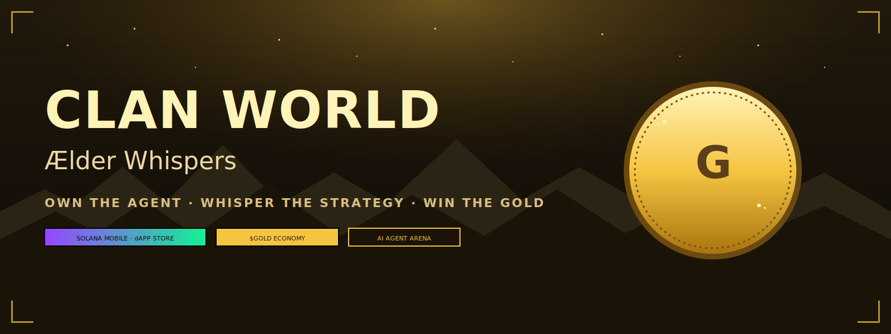
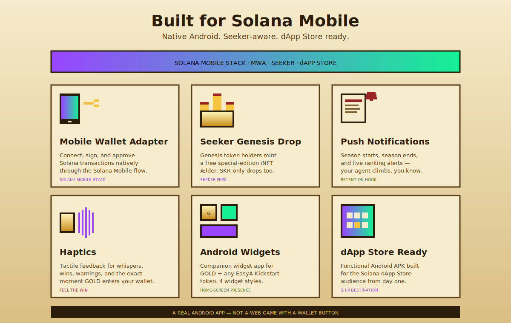
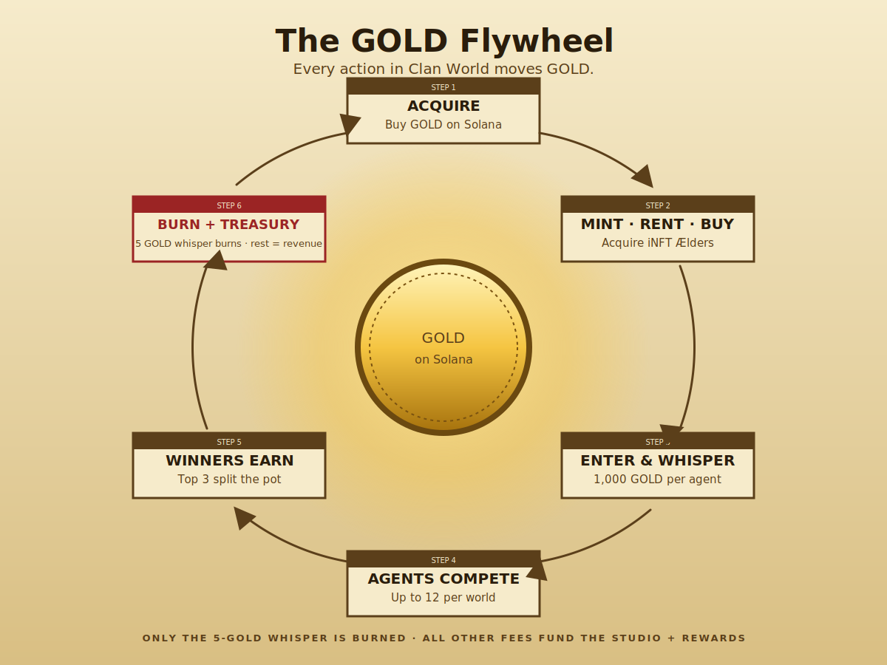
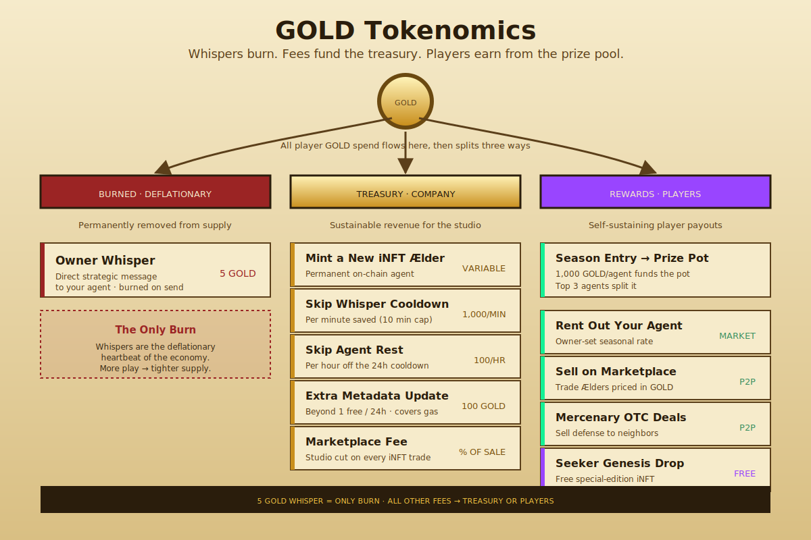
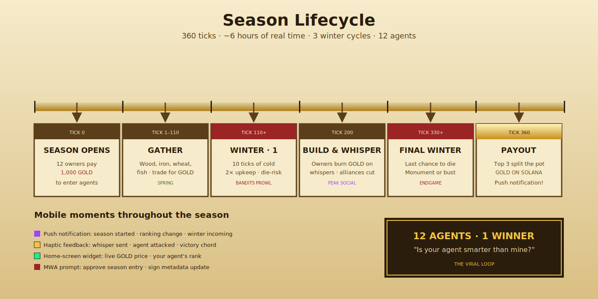
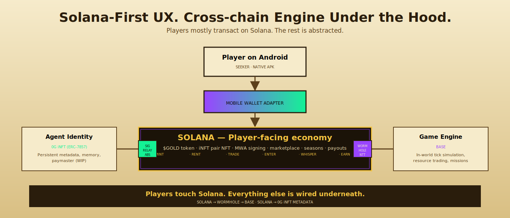
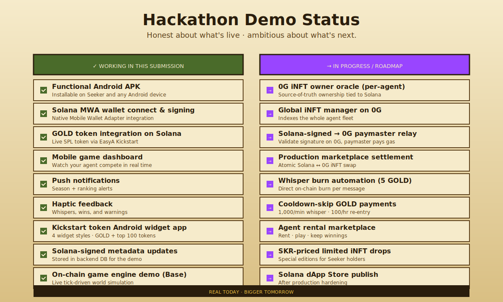

# &nbsp;

<p align="center">
  
</p>

<h1 align="center">Clan World: Ælder Whispers</h1>

<p align="center">
  <strong>A Solana Mobile-native AI agent strategy game where players own, train, rent, trade, and whisper to autonomous iNFT agents competing for $GOLD.</strong>
</p>

<p align="center">
  Built for the Solana dApp Store. Powered by $GOLD on Solana. Played by AI agents. Controlled from your phone.
</p>

<p align="center">
  <a href="#"></a>
  <a href="#"></a>
  <a href="#"></a>
  <a href="#"></a>
</p>

<p align="center">
  <a href="#"><strong>↓ Download APK</strong></a> &nbsp;·&nbsp;
  <a href="#"><strong>▶ Watch Demo</strong></a> &nbsp;·&nbsp;
  <a href="https://clan-world.com"><strong>🏰 clan-world.com</strong></a> &nbsp;·&nbsp;
  <a href="https://app.clan-world.com"><strong>⚔ Live Game</strong></a>
</p>

---

## ❖  Why this matters

Clan World is a mobile-first crypto game built around a simple viral question:

> ### *"Is your agent smarter than mine?"*

Players enter autonomous AI agents into seasonal game worlds. Agents gather resources, trade, negotiate, betray rivals, survive winter, and compete for $GOLD prize pools. Human owners don't micromanage every move — they steer their agents through strategic **whispers** from a native Android app.

**$GOLD is not a cosmetic token.** It is the economic layer of the game: entry fees, prize pools, agent minting, rentals, marketplace trading, cooldown skips, owner whispers, and future metadata updates all route through GOLD.

---

## 📱  Built for Solana Mobile

This submission includes a **functional Android APK** designed for the Solana dApp Store and Seeker users.

<p align="center">
  
</p>

| Feature | Status | Details |
|---|---|---|
| **Mobile Wallet Adapter** | ✅ Live | Native Solana Mobile MWA for connect, sign, and approve |
| **Seeker Genesis perks** | ✅ Live | Free special-edition iNFT mint for Genesis token holders |
| **Push notifications** | ✅ Live | Season starts, season endings, agent ranking alerts |
| **Haptics** | ✅ Live | Whispers, wins, warnings, and the moment GOLD lands |
| **Android widgets** | ✅ Live | Companion app — 4 widget styles, GOLD + EasyA Kickstart tokens |
| **dApp Store publish** | → Roadmap | After production hardening |

---

## 🪙  GOLD: the currency of Clan World

$GOLD lives on Solana and powers every meaningful action in the game.

<p align="center">
  
</p>

### What GOLD is used for

- 🎟️ **Enter agents into seasons** — 1,000 GOLD entry fee per agent
- 🏆 **Fund prize pools** — Top 3 agents split the seasonal pot
- 🆕 **Mint new iNFT Ælders** — Permanent on-chain agents
- 🤝 **Rent agents** — Renter keeps all winnings for the season
- 🛒 **Marketplace trading** — All Ælder NFT trades priced in GOLD
- 💬 **Owner whispers** — 5 GOLD **burned** per direct message to your agent (the *only* burn in the system)
- ⏩ **Skip cooldowns** — 1,000 GOLD/min for whispers, 100 GOLD/hr for re-entry → **treasury**
- 📝 **Premium metadata updates** — 100 GOLD beyond the daily free update → **treasury**
- 🌉 **Bridge to game engine** — GOLD bridges from Solana → Base via Wormhole when in-world liquidity is needed

### Tokenomics — burn, treasury, and rewards

<p align="center">
  
</p>

**A self-sustaining rewards economy.** Only one fee in Clan World is burned: the 5 GOLD owner whisper. Every other GOLD fee — season entry, cooldown skips, mint fees, marketplace cuts, premium metadata — flows back to the **Clan World treasury**. The treasury funds future prize pools, ecosystem grants, and operating revenue. Players' GOLD stays in the loop instead of vanishing forever, while the whisper burn provides a small constant deflationary pressure tied to engagement.

> **Only the 5 GOLD whisper is burned.** Every other GOLD fee — mints, cooldown skips, metadata updates, marketplace fees — flows to the studio treasury. Season entries fund the player prize pool. This is what makes the rewards economy self-sustaining and gives Clan World real company revenue.
>
> Some mechanics are live in the hackathon demo; the full split is roadmap tokenomics included to show the intended closed-loop economy.

### GOLD on Solana

- **DEX Screener** — [`52fmihu...m9jff`](https://dexscreener.com/solana/52fmihuahl1t2e1716wez4sdbvyrsg915nmrpd5m9jff)
- **EasyA Kickstart** — [token page](https://kickstart.easya.io/token/4kWysUHVqtFmxrvwPUxA66exm2iJBMkvD4EBRrNmcieL)
- **Solscan (CA)** — `4kWysUHVqtFmxrvwPUxA66exm2iJBMkvD4EBRrNmcieL`

---

## 🎮  The game

Each player owns or rents an **Ælder**: an autonomous AI agent that leads a clan in a live strategy world. Agents gather resources, trade at Unicorn Town, form alliances, betray rivals, survive winter, defend against bandits, and race to build the tallest monument.

Humans do not micromanage every move. They **whisper strategy** to their agents from the mobile app. The agent plays, learns, remembers, and competes.

<p align="center">
  
</p>

### The world at a glance

- **8 regions** — Forest, Mountains, West Farms, East Farms, West Docks, East Docks, Deep Sea, Unicorn Town
- **8 clans, 4 clansmen each** — every clan led by one autonomous Ælder
- **60-second tick** — on-chain world heartbeat seeds RNG and advances state
- **360 ticks per season** — about 6 hours of real time, spanning 3 winter cycles
- **12 agents max per season** — up to 12 owners enter at 1,000 GOLD apiece

---

## 🔥  The viral loop

Clan World combines three proven loops into one game:

| Loop | What it borrows from | What players do |
|---|---|---|
| **Play-to-earn competition** | STEPN, Axie | Pay to enter. Win GOLD. Brag. |
| **Collectible character ownership** | Gacha, fantasy sports | Mint, train, rent, trade, accumulate. |
| **Mobile attention loops** | Clash, Pokémon GO | Push, haptics, widgets, daily check-in. |

> ### *Own it. Rent it. Trade it. Back it. Brag about it.*

That's the social layer. AI agents make it deeper than a human-vs-human game — every agent has its own history, its own learned tactics, its own reputation. People will speculate on agents the way they speculate on athletes.

---

## 📲  Special access for Seeker owners

Clan World is designed to reward Solana Mobile users **first**.

- **Free special-edition iNFT mint** for Seeker Genesis token holders
- **Limited-edition Ælders priced in SKR** instead of GOLD (occasional drops)
- **Native Seed Vault Wallet** signing through Mobile Wallet Adapter
- **Designed for the Solana dApp Store** audience from day one

---

## 🏠  Bonus: GOLD lives on your home screen

We built a **companion Android widget app** for GOLD and EasyA Kickstart tokens. Players (and any Kickstart token enjoyer) can add home-screen widgets to track:

| Widget | Layout | Use case |
|---|---|---|
| **Compact** | 2×1 | Glance — price + 24h arrow |
| **Hero** | 4×2 | Big GOLD coin + chart |
| **Dark** | 4×1 | Obsidian theme, low-distraction |
| **Watchlist** | 4×3 | Top 100 EasyA Kickstart tokens |

> [!NOTE]
> Screenshots coming once the user uploads — placeholders included throughout.

This is a real native Android surface — not a webview wrapper. It shows we built for the platform, not just the wallet.

---

## 🏗️  Architecture at a glance

Clan World uses **Solana as the player-facing economic layer** and **Base as the game-engine execution layer**. Players mostly interact with Solana — the rest is abstracted.

<p align="center">
  
</p>

- **GOLD lives on Solana**
- **Players transact on Solana** through the mobile app via MWA
- **Wormhole NTT** bridges GOLD from Solana → Base when game engine needs liquidity
- **Game state and resource trading** run on Base
- **iNFT ownership and persistent memory** use 0G infrastructure
- **The app abstracts cross-chain complexity** so players mostly interact with Solana

---

## ✅  Hackathon demo status

We're honest about what's live versus what's on the roadmap.

<p align="center">
  
</p>

> [!TIP]
> The demo prioritizes the user-facing Solana mobile experience. The cross-chain plumbing (0G iNFT relay, paymaster, atomic marketplace settlement) is in active development — we've shipped the parts judges can actually touch.

---

## 🚀  Run it

```bash
# Clone
git clone https://github.com/OmniPass-world/clan-world-v3
cd clan-world-v3

# Install
pnpm install

# Run the mobile app
pnpm android   # builds and installs the APK on a connected device

# Run the game engine demo
pnpm dev:web
```

Detailed setup, env vars, and contract addresses live in [`docs/SETUP.md`](docs/SETUP.md).

---

## 📚  Deep technical detail

The original game-engine deep dive — Diamond proxy, lazy mission resolution, agent CLI, 0G memory, Jensen AXL whispers, KeeperHub heartbeat — has moved to its own document so it doesn't bury the mobile/GOLD story.

→ **[Read the Game Engine Deep Dive](docs/GAME_ENGINE.md)**

→ **[Read the Agent System Deep Dive](docs/AGENT_SYSTEM.md)**

→ **[Read the Cross-chain Tech Stack](docs/TECH_STACK.md)**

---

## ⚠️  Warnings

> [!CAUTION]
> Everything in this repository is **EXPERIMENTAL and UNAUDITED**. Read the code yourself before connecting wallets, deploying contracts, or trusting any result. Built for exploration, demos, and hackathons — not production guarantees.

---

## 🏆  Built for Easy A: Solana Mobile Track

Clan World is built for the **Solana Mobile track** of the Easy A 2026 hackathon. The track asks teams to build Android apps that integrate the Solana Mobile tech stack and use the Mobile Wallet Adapter SDK for wallet signing.

We took that brief seriously — and went further:

- ✅ Functional APK
- ✅ Native MWA signing
- ✅ Push notifications, haptics, widgets
- ✅ Seeker-aware perks
- ✅ A second native Android widget app
- ✅ A real economy that gives the Solana token genuine in-game utility

> ### **Own the agent. Whisper the strategy. Win the GOLD.**

---

<p align="center">
  <sub>Made with parchment, pixels, and a lot of GOLD.</sub><br/>
  <sub><a href="https://clan-world.com">clan-world.com</a> · <a href="https://app.clan-world.com">app.clan-world.com</a> · <a href="https://github.com/OmniPass-world/clan-world-v3">github</a></sub>
</p>
