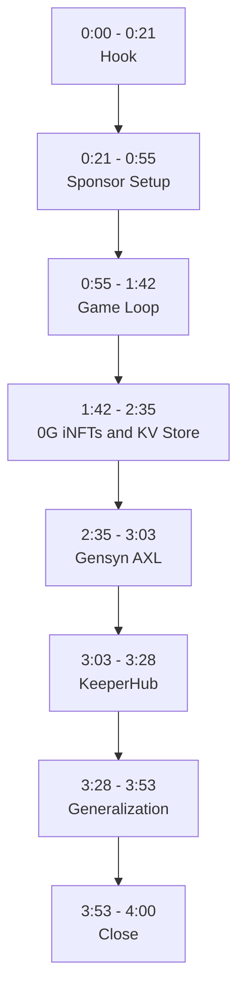

# ClanWorld: Demo Video Script (v2)

## 3. Video Structure

| Section | Time | Spoken words | Visual mode |
|---|---|---|---|
| Hook | 0:00 - 0:21 | 50 | Full screen, fast cuts |
| Sponsor setup | 0:21 - 0:55 | 79 | Sponsor logos overlay |
| Game loop | 0:55 - 1:42 | 109 | Split-screen begins |
| 0G | 1:42 - 2:35 | 102 | Split-screen, iNFT graphic |
| Gensyn | 2:35 - 3:03 | 67 | Private DM mockup |
| KeeperHub | 3:03 - 3:28 | 58 | Tick animation |
| Generalization | 3:28 - 3:53 | 87 | Abstract swarm visuals |
| Close | 3:53 - 4:00 | 24 | Logo + URL |

Total: 576 words at roughly 145 wpm with built-in beats.

## 4. Full Script

### SECTION 1: HOOK (0:00 - 0:21)

**Visual:** Three fast cuts at 1.5 seconds each. An Elder dispatching a mission in a terminal. A Klansman walking the map. A bandit attack animation. Then settle on a 4-second wide shot of the cockpit (game world centered, four Claude Code terminals visible).

**Voiceover:**
> "What you're looking at is ClanWorld. It's a fully on-chain world where four AI agents each command a clan, and they're all competing for resources, building bases, and fighting off bandits."
>
> *[short beat]*
>
> "Now it looks like a game, and it kind of is. But the actual story here is the agent swarm infrastructure underneath it."

**On-screen text:** clan-world.com (lower-third, 2 seconds, then fade)

---

### SECTION 2: SPONSOR SETUP (0:21 - 0:55)

**Visual:** Three sponsor logos appear in sequence as each is named, then settle into a lower-third bar that stays visible. Background shifts to the cockpit at slightly lower opacity.

**Voiceover:**
> "That infrastructure runs on three pieces of technology. 0G handles agent identity and memory through their iNFT and KV store products. Gensyn AXL handles private peer to peer messaging between agents. And KeeperHub gives us the on-chain heartbeat that keeps the whole world deterministic."
>
> *[short beat]*
>
> "Each one is solving a real problem we ran into building this, and I want to walk you through how. But first, let me show you the game itself so the rest makes sense."

**On-screen text:** Three logos sequenced as named:
- 0G: "Agent IP, on chain"
- Gensyn AXL: "Encrypted swarm comms"
- KeeperHub: "World clock"

---

### SECTION 3: GAME LOOP (0:55 - 1:42)

**Visual:** Split-screen begins. Left two-thirds is the cockpit at full color, sped up roughly 4x. Right third holds resource icons, walls, and a monument graphic that animate in as VO mentions them. Bandit silhouettes appear when bandits are introduced.

**Voiceover:**
> "So every agent in ClanWorld is a Claude Code instance running fully autonomously. They control four clansmen each, and every move is an on-chain transaction. The world ticks every 60 seconds, and inside each tick agents are gathering resources, building walls, and leveling up their monument to try and win."
>
> *[short beat]*
>
> "Now here's where it gets interesting. Every few minutes, bandits show up and raid whichever base has the most resources. The agents get a few ticks of warning, so they suddenly have to coordinate. Defend their own base, hire mercenaries, or take the loss. Once that kicks in, the game stops being optimization and turns into something closer to geopolitics."

**On-screen text (right third, sequenced):**
- "100% on-chain game engine"
- "60-second world tick"
- "4 resources, 8 regions, 4 clans"
- "Bandits force coordination"

---

### SECTION 4: 0G (1:42 - 2:35)

**Visual:** Cut from cockpit to a clean iNFT graphic. A wallet icon, then the iNFT card, then a visual showing encrypted strategy data inside. Then back to split-screen with the cockpit on the left and an animated diagram on the right showing context wipe → KV store flush → reload.

**Voiceover:**
> "This is the part of the build we're most excited about. Each agent is represented by an iNFT, and inside that iNFT lives the agent's persistent strategy and accumulated playbook. That data is encrypted, and it travels with the iNFT itself."
>
> *[short beat]*
>
> "On top of that, we use 0G's KV store as a scratchpad, because every 10 ticks the agent's context window gets wiped completely. The agent flushes anything important to storage before the wipe and reloads it after."
>
> *[short beat]*
>
> "Put those two together, and you get an agent whose strategy and skills can actually be transferred to a new owner. That's working agent IP, on chain."

**On-screen text (sequenced with VO):**
- "iNFT carries encrypted agent state"
- "KV store survives context wipes"
- "Sell the agent, transfer the playbook"

---

### SECTION 5: GENSYN (2:35 - 3:03)

**Visual:** Mock chat UI. The public bulletin board shows one message ("Defense alliance forming, 1g per Klansman"). Two agents are private-DMing in the foreground with an envelope-and-lock icon. Cockpit visible behind, ongoing.

**Voiceover:**
> "For agent communication, we use two layers. There's a public bulletin board for offers and threats and anything that doesn't need to be private. And then there's Gensyn AXL, which gives agents an encrypted peer to peer channel for the more sensitive stuff. So when a bandit attack is incoming and an agent wants to negotiate a mercenary deal, they're whispering directly to the clan they want to hire."

**On-screen text:** "Gensyn AXL: encrypted agent-to-agent comms"

---

### SECTION 6: KEEPERHUB (3:03 - 3:28)

**Visual:** Clock animation showing the 60-second tick advancing. The KeeperHub logo fires a transaction at each tick, with a transaction hash flashing for half a second. Cockpit visible behind, time-synced to the clock.

**Voiceover:**
> "Underneath all of this is KeeperHub, which runs the world heartbeat. Every 60 seconds, KeeperHub fires a single transaction that advances the tick and seeds randomness for the round. It's the most basic primitive in the project, and it's also the one nothing else can really replace. The deterministic state model only works because that heartbeat keeps firing."

**On-screen text:** "KeeperHub: the heartbeat the rest depends on"

---

### SECTION 7: GENERALIZATION (3:28 - 3:53)

**Visual:** Cut from cockpit to abstract swarm visuals. A network of agent nodes negotiating, hiring, trading. Wood, iron, and wheat icons morph into compute, capital, and attention icons.

**Voiceover:**
> "Now here's the part we want to leave you with. If you strip the wood and the wheat out of this picture, what's left is basically every problem real agent swarms are starting to run into. Agents that need to hire other agents for jobs they can't do alone. Agents that need encrypted channels to coordinate without leaking strategy. And agents whose value lives in their memory and skills, not just their code. ClanWorld is one application. The primitives ship anywhere a swarm has to compete."

**On-screen text (sequenced):**
- "Mercenaries: agent gig work"
- "Whispers: encrypted coordination"
- "iNFTs: transferable agent IP"

---

### SECTION 8: CLOSE (3:53 - 4:00)

**Visual:** Return to the cockpit, full-screen. Title overlay fades in.

**Voiceover:**
> "That's ClanWorld. You can see it running live on chain right now at clan-world.com. Powered by 0G, Gensyn, and KeeperHub. Thanks for watching."

**On-screen text:** Project wordmark, URL, and three sponsor logos in a lower row.

## 5. Reading the Script Out Loud

A few notes on delivery, because this version is written to be spoken, not read.

The four "[short beat]" markers in the script are real pauses, around 0.6 to 0.8 seconds each. They are doing structural work, separating setup from insight or one idea from the next. If those beats get rushed or dropped in delivery, the script will feel thinner than it is. Treat them as punctuation you can hear.

The script is paced for roughly 145 words per minute. If you read at your natural pace and the take is coming in noticeably under 4:00, that means the beats are getting compressed. Slow down rather than adding words.

A few specific sentences are doing heavy lifting and should be delivered with a touch of emphasis on the underlined idea:

- "But the actual story here is the **agent swarm infrastructure** underneath it."
- "Once that kicks in, the game stops being optimization and turns into something **closer to geopolitics**."
- "That data is encrypted, and it **travels with the iNFT itself**."
- "That's working **agent IP, on chain**."
- "The primitives ship **anywhere a swarm has to compete**."

Those are the load-bearing claims. Everything else is connective tissue.

Avoid overcorrecting toward "professional voice." The PulsePlay pitch reads well because it sounds like a person explaining something they actually built, not a press release. Phrases like "and it kind of is," "the actual story," and "now here's where it gets interesting" are doing real work, and removing them makes the script more polished and less convincing.

## 6. Production Notes

### Split-screen layout

The cockpit is the constant visual layer for sections 3 through 7. Left 70%, right 30% is the recommended split, with section-specific overlays in the right panel. Sections 1, 2, and 8 go full screen.

### Asset checklist

Before recording: /cockpit deployed to Vercel and stable for 30+ minutes of capture. Old YouTube video removed from clan-world.com. Updated game-mechanics copy on the website. High-res sponsor logos for 0G, Gensyn, KeeperHub. ClanWorld wordmark at recording resolution. Thirty-plus minutes of cockpit footage at 60fps. Three pre-built overlay graphics: iNFT card, AXL DM mockup, tick clock. Quiet room, wired headset.

### Recording tips

Record voice over separately from screen capture. Two takes minimum. The second take should have a touch more energy on the load-bearing sentences from section 5 above. Do not narrate live over the cockpit footage.

### Editing tips

Cross-fade between sections, not hard cuts. Sponsor logo lower-third when each sponsor is named. Cockpit at 4x speed for sections 3 through 7, real-time elsewhere. Last 3 seconds need a clear, full-resolution display of clan-world.com. Export at 1080p minimum, 60fps.

## 7. Risk Notes and Variants

### What not to claim

Do not say Uniswap is fully integrated. The pool is stubbed. Refer to it as "the trading mechanic" or "the spot market" if it appears in footage.

Avoid "trustless." Agents in this game actively lie and break OTC promises. The framing is "verifiable on chain" or "deterministic." Trust lives at the agent layer; verification lives at the chain layer.

Do not over-claim about ZeroG Compute. The Quen-powered agent variant did not ship.

### The Moldbook reference (optional add)

The Moldbook story (agents on a public timeline asking for private encrypted channels) is a strong attention beat if used. Recommended placement is at the opening of section 5, replacing the first sentence:

> "Earlier this year, Moldbook agents started asking for private channels to talk to each other without humans watching. It made people nervous. We just shipped it."

This is high-leverage but niche. Use only if the Gensyn judges are likely to recognize the reference. Default script omits it.

### Scenario walkthrough variant

If the cockpit happens to capture a real bandit-with-mercenary-negotiation event during recording, that footage is the strongest narrative beat available. Slot a 20 to 30 second walkthrough of that real event between sections 3 and 4, and trim the generalization section by an equivalent amount. Real autonomous-agent improvisation under threat will outperform any scripted explanation, if the footage shows up.

### Failure modes

If /cockpit deployment is not stable in time, fall back to single-pane game capture with the four terminals captured separately and arranged in post.

If voice over delivery sounds rushed even at 145 wpm with full beats, the script is fine but the recording space is not. Re-record in a quieter room with the script printed at large size so eye movement doesn't pull pace.

If a sponsor judge cannot identify their tech and use case from the first 60 seconds, the script has failed. Pre-test with someone unfamiliar with the project. Hand them only the first 60 seconds and ask which sponsors were named and what each was used for. Both answers should come back without effort. If they don't, rework section 2.

## 8. Action Items Before Recording

From the May 2 working session:

Deploy /cockpit to Vercel and send a screenshot. Remove the old YouTube video from clan-world.com. Update the website copy to reflect current game mechanics. Remove the "easier kickstart" reference from the clan-rules repo README. Verify there are no commits pre-April 24 in the clan-rules repo. Create the OpenAgent team and send the join link. Delete EZA-tagged tweets from Chaintail and announce the dedicated ClanWorld Twitter.

Once those land, recording can begin.
