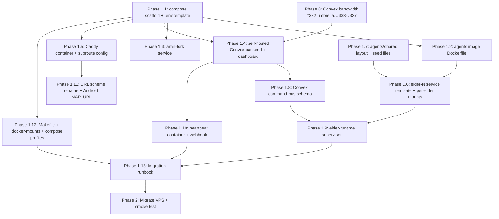

# Dockerize Elder Infra — v1 Implementation Plan

**Status:** ready for execution (overnight)
**Author:** orchestrator, synthesizing rounds 2-4 design + Convex research synthesis (all in `~/claudes-world/tmp/dockerize-elder-infra-*-2026-05-16.md` and `convex-research-synthesis-2026-05-16.md`)
**Date:** 2026-05-16
**Target merge:** `dev` (via stacked `dev-phase-1-dockerize` integration branch)

---

## Executive summary

Move the four ClanWorld Elders off ad-hoc `~/agents/elders/elder-N` + the central `clanworld-runner.service` send-keys daemon, and onto a docker-compose stack of per-elder containers backed by a self-hosted Convex command-bus. Decompose today's monolithic runner into a per-elder runtime that claims commands out of Convex with lease semantics, plus a thin heartbeat container that just ticks the chain. Add an anvil-fork RPC service for dev so we stop burning real Base Sepolia RPC credits during iteration. Caddy-in-container fronts the lot at `app.clan-world.com` with subroutes (`/`, `/map`, `/elder-N`), preserving the host caddy's unrelated tunnels (pm-dobot, narrator, etc.) by routing only the clan-world hostname through the new container. Lock everything to a Convex egress baseline already pre-merged in Phase 0 (issues #332-#337) so we are self-hosting an efficient I/O pattern, not the broken one.

## Problem statement (current state → desired state)

Today, the four Elders live as untracked state on the VPS: `~/agents/elders/elder-N` houses each Elder's `.claude` and per-elder env; `~/clan-world/elder-N/` houses tmux session state and workspace; `clanworld-runner.service` runs as a systemd user unit and uses `tmux send-keys` to inject tick updates into each Elder's CC prompt; heartbeat is a separate shell script under `~/bin`. Convex is the hosted `dev:valuable-kudu-985` deployment. There is no reproducibility — bringing up a new VPS or onboarding a teammate requires Liam to hand-walk the entire stack. There is no isolation — every Elder shares the same Unix user and filesystem, and a misbehaving Elder can read peer state. Restart granularity is coarse: stopping one Elder requires touching tmux and the runner. And Convex bandwidth is broken (~55 MB/h on a turn-based game with sub-KB tick deltas), which Phase 0 fixes before we self-host.

The v1 dockerize migration solves four things at once: **reproducibility** (whole stack defined in `docker-compose.yml`, brought up by `make up`), **isolation** (per-Elder containers, no shared filesystem outside explicit R/O mounts), **coordination** (Convex-backed command bus replaces send-keys, with lease/retry/idempotency), and **dev velocity** (anvil-fork eliminates real-RPC dependency for iteration). Production deploys eventually use the same compose stack pulled from GHCR, but v1 is a single-VPS bring-up that succeeds the moment four Elders are tick-acting against a self-hosted Convex inside containers and the existing frontend renders the map at `app.clan-world.com/map`.

## Phase dependency graph



**Parallel-safe pairs:** {P1.2, P1.3}, {P1.7, P1.8}, {P1.10, P1.11}.
**Critical path:** P0 → P1.1 → P1.4 → P1.8 → P1.9 → P1.13 → P2.
**Estimated overnight time-to-merge for Phase 1:** 10-14 PRs landing in parallel waves, ~6-10h of agent execution if dispatched in three waves (scaffolding wave, body wave, glue wave).

---

## Phase 0 — Convex bandwidth + storage (already filed)

**Status:** in flight. Do NOT start Phase 1.4 (self-hosted Convex) until Phase 0 has landed all five child PRs to `dev`. Phase 1 PRs that don't touch Convex (1.1, 1.2, 1.3, 1.5, 1.7, 1.11, 1.12) can begin in parallel.

| Issue | Title | Status |
|---|---|---|
| #332 | Convex bandwidth + storage optimization (umbrella) | OPEN |
| #333 | Split getSnapshot into tickClock + worldSnapshot | IN FLIGHT (PR #338 → `dev`) |
| #334 | No-op delta guards on banditView/marketState/worldSnapshot writes | OPEN |
| #335 | Drop redundant 5s refresh cron, drive from heartbeat webhook only | OPEN |
| #336 | Cap + split getRecentChainEvents for UI ticker vs battle resolution | OPEN |
| #337 | Convex storage retention policies (24-36h purge + preserve latest world state) | OPEN |

**Acceptance for Phase 0 close-out:**
- All five child PRs merged to `dev`
- Per-function bandwidth metrics from Convex dashboard attached as evidence on each PR
- Sustained measured egress <15 MB/h over a 60-minute typical game load window

**Phase 0 gate (Finding 1 fix — replaces prior ambiguous fallback).** The rule is HARD: Phase 1.4 (self-hosted Convex) and Phase 1.8 (command-bus schema, which deploys to self-hosted Convex) are BLOCKED on all five Phase 0 child PRs landing in `dev`. The dependency graph encodes this; Wave 2 ordering enforces it. The prior "if Phase 0 stalls, Phase 1 still proceeds" line is RETRACTED — proceeding without Phase 0 self-hosts a broken bandwidth pattern that the rest of the plan's smoke tests don't catch. Phase 1 PRs that don't touch Convex (1.1, 1.2, 1.3, 1.5, 1.7, 1.11, 1.12) may proceed in parallel.

---

## Phase 1 — Dockerize

### Locked decisions (from round 4 + earlier rounds)

1. **Parallel-coexist cutover (NOT big-bang).** Stand up the compose stack in parallel with the current VPS layout on different ports. Legacy systemd units stay ENABLED AND RUNNING through Phase 2 internal smoke + Caddy cutover + a 30-minute observation window. ONLY after the 30-min coexist window validates all 10 smoke-test acceptance criteria do we disable legacy. This is the locked cutover policy — Phase 2 implements it in this order: (1) compose up on alternate ports, (2) Convex import, (3) internal smoke, (4) Caddy snippet add (additive, host caddy still routes legacy too), (5) 30-min coexist observation, (6) full smoke acceptance gate, (7) disable legacy systemd, (8) archive legacy state. If any step fails, legacy stays live and rollback is "remove the additive Caddy snippet + `docker compose down`". See Phase 2 for exact commands and the validation gate before step 7.
2. **Self-hosted Convex** in a separate container (backend + dashboard + SQLite). Image pin: `ghcr.io/get-convex/convex-backend:<commit-sha>` (not `:latest`), dashboard `ghcr.io/get-convex/convex-dashboard:<commit-sha>`. Admin key persisted via env var, not auto-regen.
3. **Anvil-fork container for dev RPC** — `dev` compose profile only. Prod profile points at real Base Sepolia.
4. **One container per Elder.** v1 spins up 4 Elders. Service definition is parameterized so 12-Elder mode is a config change (the compose file uses templated YAML or a small `gen-compose.sh` that emits per-Elder service blocks from a list).
5. **Caddy in a container,** see decision below for coexistence with host caddy.
6. **Heartbeat in a separate container** — thin, just ticks the chain. The Convex webhook already exists at `apps/server/convex/http.ts:5` and just needs to be turned back on.
   - **Chain selection (Finding 9 fix):** Explicit env var `CHAIN_NETWORK=dev|prod` controls RPC URL. `dev` → `http://anvil-fork:8545` (docker network). `prod` → public Base Sepolia / Infura RPC. NO fallback between modes. Heartbeat container fails fast at startup if `CHAIN_NETWORK` is missing or unrecognized.
   - **Pre-flight assertion (Finding 9 fix):** Heartbeat container's entrypoint logs and asserts: profile, `CHAIN_NETWORK`, RPC URL, observed chain ID via `eth_chainId`, contract address, expected diamond owner. Fails fast if observed chain ID ≠ expected for profile (e.g. `CHAIN_NETWORK=prod` but `chainId == 31337` means we're pointed at a local anvil — abort).
7. **Convex command-bus schema** with typed verbs: `user_message`, `system_message`, `snapshot_request`, `reset`, `freeze`, `unfreeze`. Lease + retry + sweep. Broadcast supported. `unfreeze` is first-class (Finding 6 fix) — without it a frozen Elder is only recoverable by out-of-band container restart, defeating the bus. The runtime treats `freeze` as setting an in-memory `frozenUntil = +infinity` and `unfreeze` as clearing it; both are processed even when frozen (operator control commands bypass the freeze gate per Finding 25).
8. **Mount taxonomy** — per-Elder R/W `home/.claude` volume + R/O overlays from `agents/shared/home-claude/`, plus per-Elder R/W `workspace/`.
9. **ANCIENT_WISDOM.md** auto-injected via `SessionStart` hook from per-Elder workspace.
10. **No network egress** except an explicit allowlist (resolves Finding 4):
    - **Outbound TCP/443 allowed to:** `api.anthropic.com`, `claude.ai`, `accounts.anthropic.com`. (Codex API hosts added later under separate issue.)
    - **Internal Docker network allowed:** the `clan-world-internal` bridge subnet (resolved at container init via `ip route | awk '/eth0/{print $1}'`). This permits container-to-container traffic to `convex-backend:3210`, `anvil-fork:8545`, `caddy:8080`, `heartbeat`, etc. without enumerating service IPs.
    - **Docker DNS allowed:** UDP/TCP 53 to `127.0.0.11` (Docker embedded DNS).
    - **Public DNS allowed:** UDP 53 to whatever resolver `/etc/resolv.conf` lists (needed for the Anthropic hostnames). The init script reads `/etc/resolv.conf` at startup and adds explicit rules per nameserver.
    - **DENIED by default:** GitHub, npm registry, Google, generic IPv4 internet. Image build is the ONLY time `npm install`/`apt-get` runs; runtime egress is locked down. If an agent needs npm/GitHub at runtime, file a follow-up issue (Phase 1.6 acceptance must include a test confirming this is blocked).
    - **Implementation:** iptables init script (`agents/shared/init-firewall.sh`) modeled on `.devcontainer/init-firewall.sh` from anthropic/claude-code repo. Runs at container init as root (via `cap_add: NET_ADMIN`), drops to `elder` user via entrypoint exec.
    - **Test matrix (must all pass in Phase 1.2 acceptance):** Convex backend reachable from elder, anvil reachable, Claude API reachable, Google NOT reachable, GitHub NOT reachable, npm registry NOT reachable, behavior persists after container restart.
11. **`run.sh` wrapper — explicit session ID, not `--continue`.** Original design used `claude --continue` which depends on the CC project-path encoding heuristic (encoded CWD under `~/.claude/projects/`) — that encoding is NOT a documented stable API and changes have broken it before. Replacement: on first run, `run.sh` invokes `claude` fresh, captures the resulting `session-id` from CC's startup output, writes it to `/home/elder/.session-id` (chmod 600). On subsequent runs, `run.sh` reads `/home/elder/.session-id` and invokes `claude --resume <session-id>` (explicit, no path-encoding guess). If `--resume` fails (session not found), `run.sh` falls back to fresh `claude` and rewrites the session-id file. Phase 1.7 acceptance must include a test that starts CC, writes a marker, restarts the container, and proves `--resume` resumes the same session (not a new one).
12. **Makefile orchestration** at `agents/Makefile` for `up/down/pause/unpause/reset-elder-N/wipe-elder-N/restart-elder-N`.
13. **Domain configurable** via `.env`: `CLAN_WORLD_DOMAIN` and `TLD_APP_SUBDOMAIN`. Defaults `clan-world.com` + `app`.
14. **URL scheme** rationalized:
    - `app.clan-world.com/` → Cockpit (currently at `/cockpit`)
    - `app.clan-world.com/map` → public map (currently at `/`)
    - `app.clan-world.com/elder-N` → ttyd for Elder N
15. **Submodule mount:** dev profile bind-mounts `agents/` R/O from host. Prod profile bakes `agents/shared/` into the image at build time (immutable).
16. **No `scratch/`,** just `workspace/`.

### Open items — positions taken

#### A. Skills dir conflict

**Decision: per-Elder R/W single skills dir, with versioned seed manifest (revised from Pattern B — Finding 7 fix).** No multi-path discovery (CC's docs don't promise it portably), no overlayfs (adds Docker complexity). The shared base ships with a manifest at `agents/shared/home-claude/skills/.manifest.json` containing per-skill `{path, sha256, version}`. On each `run.sh` invocation:

1. Read the shared manifest (R/O mount).
2. Read `/home/elder/.claude/skills/.installed-manifest.json` (per-elder, R/W).
3. For each skill in shared:
   - If absent from installed → copy in.
   - If installed sha256 matches the manifest's prior-version sha256 → update to current version (overwrite).
   - If installed sha256 does NOT match prior-version sha256 → user-modified; leave alone, log warning.
4. Write current shared sha256s back to `.installed-manifest.json`.

This means fixed shared-skill BUGS propagate on next container init (unlike the prior `cp -rn` design which never propagated). Operator-modified skills are preserved (the per-elder workflow stays viable). `make refresh-shared-base ELDER=N` is provided as an explicit force-refresh target that backs up `~/.claude/skills/` to `~/.claude/skills.bak-<ts>/` and re-seeds from shared.

Trade-off: shared-base updates propagate on next container init (`make restart-elder-N`), not live. We accept this because (a) live propagation is a separate problem, (b) `make restart-elder-N` is one command, (c) overlayfs complexity is real and we want to ship.

#### B. Anvil-fork — diamond redeploy vs impersonate?

**Decision: impersonate the existing owner via `--auto-impersonate`.** The diamond at `${CLAN_WORLD_CONTRACT_ADDRESS}` is already on the forked block. Redeploying a new diamond would diverge our dev environment's address from staging/prod, requiring per-env address management and breaking any hardcoded references in old transcripts. Impersonation lets us call `diamondCut` against the existing diamond with the existing owner — zero code paths change between dev (fork) and prod (real). The `forge script` invocations stay unchanged. We accept that fork state is not a perfect replica of mainnet (events emit on the fork, not chain), which is fine for elder iteration.

#### C. Convex command `kind="user_message"` payload shape

**Decision: `{text: string, replyToCommandId?: Id<"agentCommands">}` only for v1.** Start minimal. Add fields (`turnId`, `expectsResponse`, `priority`) only when a concrete use case demands them. Convex's `v.any()` payload type allows future schema evolution without migration. Add a `payloadVersion: v.number()` field in the table for forward compatibility.

#### D. Caddy in container vs host caddy

**Decision: keep host caddy authoritative, route ONLY the `${CLAN_WORLD_DOMAIN}` (i.e., `clan-world.com`) hostname to the docker Caddy.** The host caddy currently fronts pm-dobot, gstack, narrator, and other unrelated tunnels through cloudflared — we do not break those. We add ONE new server block to the host caddy that reverse-proxies `${TLD_APP_SUBDOMAIN}.${CLAN_WORLD_DOMAIN}` → `127.0.0.1:${COMPOSE_CADDY_PORT}` (we'll allocate a unique port via `port-for clan-world-docker-caddy`). Inside the container, the docker caddy handles the subroute fan-out (`/`, `/map`, `/elder-N`). Host caddy stays as the single TLS terminator + cloudflared peer; docker caddy is path-routing-only on plain HTTP inside the compose network. This minimizes the blast radius if the docker stack misbehaves: nothing about pm-dobot or narrator goes through the docker Caddy.

#### E. `settings.local.json` writable by Elders?

**Decision: NO.** Elder CC harness reads `~/.claude/settings.json` (mounted R/O via Pattern A overlay) at startup. There is no `settings.local.json` shipped or expected.

**Allowlist of writable paths under `~/.claude/` (Finding 17 fix — prevents bypass via sibling files):**
- `~/.claude/projects/` — R/W (CC session state, required)
- `~/.claude/skills/` — R/W (per-elder skill workspace)
- `~/.claude/.credentials.json` — R/W (per-elder OAuth credentials, populated by `oauth-bootstrap`)
- `~/.claude/state/` — R/W (CC harness runtime state)

EVERYTHING ELSE under `~/.claude/` is R/O (mounted via overlay) OR explicitly DENIED:
- `~/.claude/settings.json` — R/O overlay (denies self-modification of permission boundaries)
- `~/.claude/settings.local.json` — does NOT exist; if it appears, the SessionStart hook deletes it and logs the attempt
- `~/.claude/CLAUDE.md` — R/O overlay
- `~/.claude/hooks/` — R/O overlay
- `~/.claude/plugins/` — R/O overlay (plugins shipped via shared base only; no per-elder plugin install)
- `~/.claude/mcp-servers.json` — does NOT exist; if it appears, the SessionStart hook deletes + logs

**Startup audit (Phase 1.7 acceptance):** A `SessionStart` hook (`agents/shared/home-claude/hooks/SessionStart/audit-allowlist.sh`) runs at every CC startup. It enumerates `~/.claude/` and fails the session if any file outside the allowlist exists (writes to a log + exits non-zero so the operator sees the failure). Test (Phase 1.7 acceptance): create `~/.claude/settings.local.json` inside the container, restart, observe audit hook deletes it AND logs.

This is intentional — we want Elder behavior to be reproducible from the committed shared base. If an Elder needs a per-elder behavior override, the operator commits it to `agents/elder-N/seed/settings.json` and `run.sh` overlays it during init. Net effect: Elders cannot self-modify their own permission boundaries OR escape via sibling config files.

---

## Phase 1 sub-issues (Phase 1.1 through Phase 1.13)

Each sub-issue below is sized for one PR. Filed sequentially as GH issues #339 through #351 (or similar; numbers TBD when filed). All target branch `dev-phase-1-dockerize` per the stacked phase-branch pattern.

---

### Phase 1.1 — docker-compose.yml scaffold + .env.template

**Scope.** Add the root `docker-compose.yml`, `docker-compose.dev.yml` (profile overlay), and `.env.template` at the monorepo root. Compose declares the networks (`clan-world-internal` + external bridge), the named volumes, and stub services that bring up empty containers. No actual workloads yet — just confirm the topology resolves. Add `agents/` as a new top-level repo directory (currently doesn't exist; the `runtime/elders/` legacy lives in parallel until Phase 2 cleanup).

**Files affected.**
- `docker-compose.yml` (NEW)
- `docker-compose.dev.yml` (NEW)
- `.env.template` (NEW)
- `agents/.gitignore` (NEW — ignores `runtime/`, `.env`, `.docker-mounts/`)
- `agents/README.md` (NEW — short pointer to this plan + Makefile help)
- `.gitignore` (UPDATE — add `agents/runtime/`, `agents/.env`, `agents/.docker-mounts/`)

**Dependencies.** None.

**Complexity.** Small.

**Acceptance.**
- `docker compose config` parses without error
- `docker compose --profile dev config` parses without error
- `docker compose ps` shows the declared services (status empty)
- `.env.template` covers every variable referenced in compose, with clear comments

---

### Phase 1.2 — agents image Dockerfile

**Scope.** Build the `clan-world/agent:dev` image that every Elder container runs. Base on `node:22-bookworm-slim`. Install: `tmux`, `ttyd`, `iptables`, `jq`, `curl`, `git`, `claude-code` (via npm), `codex-cli` (deferred install if not available). Add the network-egress lockdown init script `agents/shared/init-firewall.sh` (modeled on `.devcontainer/init-firewall.sh` from `anthropic/claude-code`): allows only outbound to `api.anthropic.com`, `claude.ai`, plus DNS, plus the internal Docker network (so containers can reach `convex-backend:3210`, `anvil-fork:8545`, etc.). Run the firewall init as `ENTRYPOINT` wrapper before the actual `run.sh`. Image must run as non-root user `elder` (UID 1000) so file ownership stays sane.

**Files affected.**
- `agents/Dockerfile` (NEW)
- `agents/shared/init-firewall.sh` (NEW)
- `agents/shared/entrypoint.sh` (NEW — runs firewall init, then `exec run.sh`)
- `.dockerignore` at monorepo root (NEW or UPDATE)

**Dependencies.** Phase 1.1.

**Complexity.** Medium (iptables init has gotchas: must run as root via `cap_add: NET_ADMIN`, then drop to elder; firewall rules must NOT block the internal Docker network).

**Acceptance.**
- `docker build -f agents/Dockerfile -t clan-world/agent:dev .` succeeds
- `docker run --rm clan-world/agent:dev id` shows uid=1000(elder)
- `docker run --rm --cap-add NET_ADMIN clan-world/agent:dev curl -sf https://api.anthropic.com` succeeds (200 / expected response)
- `docker run --rm --cap-add NET_ADMIN clan-world/agent:dev curl -m 5 -sf https://google.com` fails (egress blocked)
- `docker run --rm clan-world/agent:dev which claude && claude --version` works

---

### Phase 1.3 — anvil-fork service definition

**Scope.** Define the `anvil-fork` compose service (per the round 3 design). Pin to `ghcr.io/foundry-rs/foundry:v1.2.0` (no `:latest`). Forks Base Sepolia at `${FORK_BLOCK_NUMBER}`. Persists state to a `anvil_data` named volume; `--state-interval=60`. Auto-impersonates owner. Exposes 8545 only inside the `clan-world-internal` network. Add `make reset-anvil` target (deferred to Phase 1.12) that wipes the volume.

**Files affected.**
- `docker-compose.dev.yml` (UPDATE — add `anvil-fork` service under `profiles: [dev]`)
- `.env.template` (UPDATE — add `BASE_SEPOLIA_RPC_FOR_FORK_SEED`, `FORK_BLOCK_NUMBER`, `RPC_URL_DEV` (defaults to `http://anvil-fork:8545`))
- `docs/runbooks/anvil-fork-dev-rpc.md` (NEW)

**Dependencies.** Phase 1.1.

**Complexity.** Small.

**Acceptance.**
- `docker compose --profile dev up -d anvil-fork` brings it up
- From a sibling container: `curl -sf -X POST -H 'Content-Type: application/json' --data '{"jsonrpc":"2.0","method":"eth_chainId","id":1}' http://anvil-fork:8545` returns `{"jsonrpc":"2.0","id":1,"result":"0x14a34"}` (chain id 84532)
- `docker compose --profile dev restart anvil-fork` resumes from persisted state without re-forking
- `docker compose --profile dev down -v && docker compose --profile dev up -d anvil-fork` wipes state and re-forks at the pinned block

---

### Phase 1.4 — self-hosted Convex backend + dashboard

**Scope.** Add the `convex-backend` and `convex-dashboard` compose services. Image pins: `ghcr.io/get-convex/convex-backend:<commit-sha>` and matching dashboard. Persist SQLite at named volume `convex_data`. Admin key managed by `make bootstrap-convex-admin-key` (NOT env-var or auto-regen). Expose backend at `convex-backend:3210` (internal only), dashboard at `convex-dashboard:6791` (internal — front through Caddy with basic-auth at `/convex-admin`). Convex functions deploy via `apps/server/convex/`'s existing `npx convex dev` retargeted at `CONVEX_DEPLOY_URL=http://convex-backend:3210`.

**Admin-key lifecycle (Finding 10 fix).** Explicit bootstrap + persistence:
1. **First stack-up:** Operator runs `make bootstrap-convex-admin-key` (Phase 1.12 must include this target). The target:
   - Generates a random 256-bit key via `openssl rand -hex 32`
   - Writes to `/etc/clan-world/secrets/convex-admin.key` (chmod 600, root:root via `sudo` step)
   - Records SHA256 fingerprint to `/etc/clan-world/secrets/convex-admin.key.fp` (chmod 644) for audit
   - Symlinks `agents/secrets/convex-admin.key` → `/etc/clan-world/secrets/convex-admin.key` for the compose bind-mount
   - Prints a one-line operator instruction: "Back up `/etc/clan-world/secrets/convex-admin.key` to your password manager NOW; this key is unrecoverable if lost."
2. **Persistence across restarts:** Docker secret entry in compose mounts `/etc/clan-world/secrets/convex-admin.key` R/O into the convex-backend container at `/run/secrets/admin-key`. Backend reads from file path, not env var (env vars leak through `docker inspect`).
3. **Rotation:** `make rotate-convex-admin-key` (deferred to a follow-up issue; v1 documents the manual procedure: stop backend, regenerate key, update file, restart backend, re-issue dashboard basic-auth grants). Filed as #356 (follow-up).
4. **Lost-key recovery:** If the key file is deleted/corrupted, the backend won't accept any deploy/import. Recovery is restore-from-backup OR full re-bootstrap (loses all data unless `convex_data` volume is intact and admin key is re-injected via Convex's recovery procedure — documented in the runbook).

**Files affected.**
- `docker-compose.yml` (UPDATE — add backend + dashboard services, with Docker secret mount for admin key)
- `.env.template` (UPDATE — `CONVEX_SELF_HOSTED_URL`, `CONVEX_DEPLOY_URL`, `CONVEX_CLI_PINNED_VERSION`, `CONVEX_BACKEND_TAG`, `CONVEX_DASHBOARD_TAG`)
- `apps/server/convex/README.md` (UPDATE — document self-hosted target swap + admin-key lifecycle)
- `scripts/deploy-convex-self-hosted.sh` (NEW — wraps `npx convex deploy --self-hosted`, reads admin key from `/etc/clan-world/secrets/convex-admin.key`)
- `scripts/bootstrap-convex-admin-key.sh` (NEW — invoked by Makefile target)

**Dependencies.** Phase 1.1. **Phase 0 must have merged** (so we're not self-hosting the broken bandwidth pattern). See revised Phase 0 gate language below.

**Complexity.** Medium-large (admin-key bootstrap, Docker secret integration, first-time deploy of all functions, CLI-version pinning).

**Acceptance.**
- `make bootstrap-convex-admin-key` creates `/etc/clan-world/secrets/convex-admin.key` (chmod 600), prints fingerprint, refuses to overwrite if already exists (require `FORCE=1`)
- `make up` brings both services healthy after bootstrap
- `docker compose stop convex-backend && docker compose start convex-backend` — backend resumes with same admin key (no regeneration)
- `curl -sf http://localhost:${CADDY_HOST_PORT}/convex-admin/` reaches the dashboard, basic-auth challenge presented
- `bash scripts/deploy-convex-self-hosted.sh` succeeds: all functions in `apps/server/convex/` deploy to the self-hosted instance
- From a sibling container: `convex client can query getSnapshot via http://convex-backend:3210`
- `docker compose pause convex-backend && docker compose unpause convex-backend` preserves state
- `docker inspect convex-backend` shows admin key NOT in env (only the mount)
- CLI-version pin check: `npx convex --version` returns the value in `CONVEX_CLI_PINNED_VERSION`; deploy aborts if mismatched (Finding 11 fix)

---

### Phase 1.5 — Caddy container with subroute config

**Scope.** Define the `caddy` compose service running `caddy:2-alpine`. Caddyfile provides the path-routing fan-out: `/elder-N` → `elder-N:7681` (ttyd, with WS upgrade), `/map` → frontend container (wired in Phase 1.11), `/` → frontend (cockpit), `/convex-admin/` → `convex-dashboard:6791` with basic-auth. Caddy listens on internal `:8080` (HTTP); host caddy terminates TLS upstream and reverse-proxies plain HTTP into the container. Allocate the host-side port via `port-for clan-world-docker-caddy` (NOT hardcoded).

**WebSocket upgrade for ttyd (Finding 12 fix).** ttyd uses plain HTTP/1.1 WebSocket upgrades — Caddy must explicitly enable WS upgrades and pin transport to HTTP/1.1 for the elder routes. ttyd by default serves from path `/`, so we use Caddy's `handle_path` directive to strip the `/elder-N` prefix before proxying (Finding 13 fix). Required Caddyfile snippet (canonical for `agents/caddy/Caddyfile`):

```caddyfile
:8080 {
  # WebSocket matcher (any path matching elder routes with Connection: Upgrade)
  @ws_elder {
    path /elder-1* /elder-2* /elder-3* /elder-4*
    header Connection *Upgrade*
    header Upgrade websocket
  }

  # ttyd routes: strip /elder-N prefix, pin transport to HTTP/1.1 (ttyd does NOT speak h2)
  handle_path /elder-1/* {
    reverse_proxy elder-1:7681 {
      transport http { versions h1 }
      header_up Host {host}
      header_up X-Real-IP {remote_host}
    }
  }
  handle_path /elder-2/* {
    reverse_proxy elder-2:7681 { transport http { versions h1 } }
  }
  handle_path /elder-3/* {
    reverse_proxy elder-3:7681 { transport http { versions h1 } }
  }
  handle_path /elder-4/* {
    reverse_proxy elder-4:7681 { transport http { versions h1 } }
  }
  # Also handle the bare /elder-N (no trailing slash) — redirect to /elder-N/
  @bare_elder path /elder-1 /elder-2 /elder-3 /elder-4
  redir @bare_elder {path}/ 301

  # Convex dashboard with basic-auth (Finding 14 fix — see basic-auth lifecycle below)
  handle_path /convex-admin/* {
    basicauth {
      admin {$CONVEX_DASHBOARD_BASIC_AUTH_HASH}
    }
    reverse_proxy convex-dashboard:6791 {
      transport http { versions h1 }
    }
  }

  # Frontend fallthrough (wired in Phase 1.11)
  handle /map {
    reverse_proxy frontend:3000
  }
  handle / {
    reverse_proxy frontend:3000
  }
  # Long timeouts for ttyd (interactive sessions can idle for hours)
  servers {
    timeouts {
      read_body 30s
      read_header 10s
      write 0          # 0 = no write timeout (ttyd streams)
      idle 1h
    }
  }
}
```

Host caddy snippet at `host/caddy/clan-world-docker.caddy`:
```caddyfile
app.{$CLAN_WORLD_DOMAIN} {
  reverse_proxy 127.0.0.1:{$CADDY_HOST_PORT} {
    transport http { versions h1 }
    flush_interval -1     # stream ttyd output without buffering
  }
}
```

**Basic-auth lifecycle for `/convex-admin` (Finding 14 fix).** Hash NOT committed to repo. Generated via `make bootstrap-convex-dashboard-auth` (Phase 1.12 must include this target):
1. Prompts operator for username + password (or accepts `CONVEX_DASHBOARD_USER`/`CONVEX_DASHBOARD_PASS` env vars for CI).
2. Generates the Caddy bcrypt hash via `docker run --rm caddy:2-alpine caddy hash-password --plaintext "$pass"`.
3. Writes hash to `/etc/clan-world/secrets/convex-dashboard-basicauth.hash` (chmod 600).
4. Symlinks into `agents/secrets/` for compose bind-mount; Caddy reads via env `CONVEX_DASHBOARD_BASIC_AUTH_HASH` (file content).
5. If the hash file is missing at Caddy startup, Caddy FAILS to start (no fail-open on auth). Acceptance: stop the file, `docker compose up caddy` fails with clear error.

**Files affected.**
- `docker-compose.yml` (UPDATE — add caddy service, mount secrets)
- `agents/caddy/Caddyfile` (NEW — per snippet above)
- `agents/caddy/.gitignore` (NEW — `data/`, `config/`)
- `host/caddy/clan-world-docker.caddy` (NEW — snippet per above; **routes only `app.${CLAN_WORLD_DOMAIN}`** (Finding 15 fix — wording normalized) — NOT the bare root domain)
- `scripts/bootstrap-convex-dashboard-auth.sh` (NEW)
- `docs/runbooks/caddy-coexistence.md` (NEW — explains host vs docker caddy responsibilities + WS upgrade gotchas)

**Dependencies.** Phase 1.1.

**Complexity.** Medium (the host caddy snippet must integrate cleanly without disturbing pm-dobot / narrator routes; WS path-strip + h1 pin is easy to get wrong).

**Acceptance.**
- `make up` brings caddy healthy (with elder/frontend upstreams down, expect 502 on those paths, NOT Caddy crash)
- `curl -H 'Host: app.clan-world.local' http://localhost:${CADDY_HOST_PORT}/` returns frontend (or 502 with "frontend not wired yet" if pre-1.11)
- `curl -H 'Host: app.clan-world.local' http://localhost:${CADDY_HOST_PORT}/elder-1/` returns ttyd HTML (or 502 if elder-1 down)
- `curl -H 'Host: app.clan-world.local' http://localhost:${CADDY_HOST_PORT}/elder-1` returns 301 redirect to `/elder-1/`
- **WS upgrade smoke (Finding 12 fix):** `websocat -H 'Host: app.clan-world.local' ws://localhost:${CADDY_HOST_PORT}/elder-1/ws` connects (status 101), accepts ttyd negotiation, can `echo "echo hi" | websocat` and observe `hi` in returned frames. ALSO via Playwright: `playwright test e2e/ttyd-ws-upgrade.spec.ts` opens `/elder-1/`, waits for terminal output, sends input, observes tmux scrollback.
- **Idle-timeout test:** WS connection stays alive for 30+ min without server-side disconnect.
- **Path-strip test:** static asset request `GET /elder-1/static/index.css` returns the ttyd asset (proves `handle_path` strips `/elder-1` correctly).
- `/convex-admin` returns 401 without basic-auth header; returns 200 with correct credentials.
- `/convex-admin` fails-closed if hash file missing.
- Host caddy snippet placed via the deploy-host-caddy-snippet runbook does NOT break any existing tunnel (verify by hitting pm-dobot, narrator, etc. — explicit hostname-by-hostname test).

---

### Phase 1.6 — elder-N service template + per-elder volume mounts

**Scope.** Author a single `elder-template.yml` (compose template) that emits per-Elder service blocks. v1 emits 4 (elder-1 through elder-4); a `gen-compose.sh` script generates the actual `docker-compose.elders.yml` from the template + a `clan-id → elder-num` mapping in `.env`. Each Elder service: builds from `clan-world/agent:dev`, mounts per-Elder R/W `home-claude/` + R/W `workspace/` named volumes, mounts shared R/O overlays from `agents/shared/`, exposes ttyd on `7681` (internal).

**Single container per Elder (Finding 24 fix — supersedes prior runner-as-separate-service design).** Earlier revisions placed the elder-runtime supervisor in a `runner-elder-N` companion service. That design is INVALID because separate containers do not share tmux sockets or process namespaces by default — `tmux send-keys` from a sibling container cannot reach the elder's tmux. Revised design: **runtime supervisor runs INSIDE the elder-N container as a second process** under a tini-managed init. Both processes share the same `TMUX_TMPDIR` (default `/tmp/tmux-1000`) and the same tmux server.

Process model inside each elder-N container:
1. PID 1: `tini` (Docker init, reaps zombies)
2. Child A: ttyd (port 7681) — exposes `tmux attach -t elder-N` to the operator via Caddy
3. Child B: tmux server, with session `elder-N` running `run.sh` (which exec's the CC harness)
4. Child C: `elder-runtime` supervisor (Node process) — subscribes to Convex `getQueuedFor(elderId)`, sends to tmux via `tmux send-keys -t elder-N`, records heartbeats. Started by entrypoint AFTER tmux session is created.

The entrypoint sequence (after firewall init + drop to elder user):
```
1. mkdir -p $TMUX_TMPDIR && chown elder $TMUX_TMPDIR
2. tmux new-session -d -s elder-N -c /workspace /opt/clan-world/run.sh
3. ttyd -p 7681 -W tmux attach -t elder-N &  # ttyd in background
4. exec node /opt/elder-runtime/main.js      # supervisor as PID 1's primary child
```

If the supervisor exits unexpectedly, the container exits (Docker `restart: unless-stopped` brings it back). This is intentional — if the supervisor dies, we want a known-good restart, not a zombie Elder.

**Pause/unpause runtime independence (revised).** Original goal was independent pause/unpause of supervisor vs ttyd/tmux. New mechanism: `make pause-elder-N` sends `SIGSTOP` to the supervisor PID inside the container via `docker exec elder-N kill -STOP <supervisor-pid>`; `make unpause-elder-N` sends `SIGCONT`. ttyd + tmux keep running so operator can still observe state. Phase 1.12 acceptance covers this.

The mount taxonomy:

```yaml
# elder-N service mounts (under x-elder-template):
volumes:
  # Per-Elder R/W runtime state
  - elder-N-home:/home/elder/.claude            # named volume, runtime CC harness state
  - elder-N-workspace:/workspace                # named volume, agent's output

  # Pattern A overlays from shared base (R/O bind-mounts of specific files/subdirs)
  - ./agents/shared/home-claude/settings.json:/home/elder/.claude/settings.json:ro
  - ./agents/shared/home-claude/CLAUDE.md:/home/elder/.claude/CLAUDE.md:ro
  - ./agents/shared/home-claude/hooks:/home/elder/.claude/hooks:ro

  # Shared base skills (seeded into per-Elder home via run.sh `cp -rn`, per decision A)
  - ./agents/shared/home-claude/skills:/opt/clan-world/shared/skills:ro

  # Bootstrap seed files for `make wipe-elder-N`
  - ./agents/shared/elder-bootstrap:/opt/clan-world/shared/elder-bootstrap:ro

  # Per-Elder seed override (optional, exists only if elder needs custom CLAUDE.md)
  - ./agents/elder-N/seed:/opt/clan-world/shared/seed:ro
env_file:
  - ./agents/elder-N/.env
networks:
  - clan-world-internal
cap_add:
  - NET_ADMIN                                   # for iptables init
```

`.docker-mounts/` symlinks (created via `make link-mounts`) make the named-volume contents inspectable from the host without needing `docker compose exec ls`.

**Files affected.**
- `docker-compose.elders.yml` (NEW — generated by gen-compose.sh, also committed for inspectability)
- `agents/scripts/gen-compose.sh` (NEW)
- `agents/elder-1/.env.example` ... `agents/elder-4/.env.example` (NEW — committed templates)
- `agents/elder-1/seed/CLAUDE.md` ... etc (NEW, optional)
- `agents/template/elder-service.yml.template` (NEW)

**Dependencies.** Phase 1.2 (image), Phase 1.7 (shared layout).

**Complexity.** Medium.

**Acceptance.**
- `bash agents/scripts/gen-compose.sh` produces `docker-compose.elders.yml` deterministically. CI check `git diff --exit-code docker-compose.elders.yml` after running the generator must pass (Finding 18 fix).
- `docker compose up -d elder-1` brings up elder-1 (single container with all 3 processes: ttyd, tmux+CC, supervisor)
- `docker compose exec elder-1 pgrep -fa tmux` shows tmux server running
- `docker compose exec elder-1 pgrep -fa node` shows elder-runtime supervisor running
- `docker compose exec elder-1 ls -la /home/elder/.claude/` shows the R/O overlays mounted correctly
- **First-boot empty-volume test (Finding 16 fix):** With `elder-1-home` named volume freshly empty, `docker compose up -d elder-1` does NOT fail mount ordering. Verify by `docker volume rm clan-world_elder-1-home && docker compose up -d elder-1` and observing healthy startup. The R/O file overlays (`settings.json`, `CLAUDE.md`, `hooks/`) succeed because Dockerfile pre-creates `/home/elder/.claude/` skeleton at image-build time.
- `make link-mounts` creates `agents/.docker-mounts/elder-1-workspace` symlink that resolves AND is readable by the regular user (Finding 34 fix — link-mounts must use a helper container with correct UID, not raw `/var/lib/docker` symlinks)
- **Pause/unpause test:** `make pause-elder-1` SIGSTOPs the supervisor; the supervisor process state in `docker compose exec elder-1 ps` shows `T` (stopped); tmux + ttyd continue working (operator can `tmux attach`). `make unpause-elder-1` resumes; supervisor state returns to `S`/`R`.

---

### Phase 1.7 — agents/shared/ layout + initial seed files

**Scope.** Build the `agents/shared/` directory tree per the round 4 alternative layout:

```
agents/
  Makefile                                          # Phase 1.12
  README.md
  docker-compose.elders.yml                         # Phase 1.6 (generated)
  .env.template
  .gitignore                                        # ignores runtime/, .env, .docker-mounts/
  scripts/
    gen-compose.sh                                  # Phase 1.6
  shared/
    Dockerfile                                      # Phase 1.2
    entrypoint.sh                                   # Phase 1.2
    init-firewall.sh                                # Phase 1.2
    run.sh                                          # this issue
    APPENDED_SYSTEM_PROMPT.md                       # this issue
    home-claude/
      settings.json                                 # this issue (deny rules per round 4)
      CLAUDE.md                                     # this issue (elder system prompt)
      skills/                                       # this issue (seed skills)
        lean-tick/SKILL.md
        research-mindset/SKILL.md
        # additional shared skills cherry-picked from ~/.claude/skills
      hooks/
        SessionStart/inject-ancient-wisdom.sh       # this issue
    elder-bootstrap/
      workspace-CLAUDE.md                           # this issue
      workspace-ANCIENT_WISDOM.md                   # this issue (template)
      workspace-README.md                           # this issue
    caddy/Caddyfile                                 # Phase 1.5
  elder-1/
    .env.example                                    # Phase 1.6
    seed/                                           # optional, mostly empty for v1
  elder-2/ ... elder-3/ ... elder-4/
```

The `run.sh` is canonical, lives at `agents/shared/run.sh`, is bind-mounted R/O into every Elder at `/opt/clan-world/run.sh`. The `--continue` fallback is implemented per round 4. The `inject-ancient-wisdom.sh` hook reads `/workspace/ANCIENT_WISDOM.md` and emits JSON-formatted `additionalContext` per CC's SessionStart hook API.

**Files affected.**
- `agents/shared/run.sh` (NEW)
- `agents/shared/APPENDED_SYSTEM_PROMPT.md` (NEW)
- `agents/shared/home-claude/settings.json` (NEW — with the round 4 deny rules)
- `agents/shared/home-claude/CLAUDE.md` (NEW — pulled from current Elder system prompt at `runtime/elders/personalities.yaml`)
- `agents/shared/home-claude/skills/lean-tick/SKILL.md` (NEW — copy from current `~/.claude/skills`)
- `agents/shared/home-claude/skills/research-mindset/SKILL.md` (NEW)
- `agents/shared/home-claude/hooks/SessionStart/inject-ancient-wisdom.sh` (NEW)
- `agents/shared/elder-bootstrap/workspace-CLAUDE.md` (NEW)
- `agents/shared/elder-bootstrap/workspace-ANCIENT_WISDOM.md` (NEW — the prompt-to-self template from round 3)
- `agents/shared/elder-bootstrap/workspace-README.md` (NEW)

**Dependencies.** Phase 1.1.

**Complexity.** Medium-large (lots of content to author + decisions about which existing skills are "shared base" vs left out).

**Acceptance.**
- `cat agents/shared/home-claude/settings.json | jq .` parses
- `bash -n agents/shared/run.sh` passes shellcheck
- `bash agents/shared/home-claude/hooks/SessionStart/inject-ancient-wisdom.sh` emits valid JSON with `additionalContext` key
- Total `agents/shared/home-claude/skills/` content is <= 6 skills (keep tight)

---

### Phase 1.8 — Convex command-bus schema + tables

**Scope.** Add the three tables from round 3 to `apps/server/convex/schema.ts`:

- `agentCommands` — the bus, with typed `kind` discriminated union and lease/status fields
- `elderHeartbeat` — liveness signal so orchestrator knows who's alive
- `commandResults` — separate table so retention policies differ from commands

**Typed `kind` verbs (Finding 6 fix — includes `unfreeze`):**
```ts
kind: v.union(
  v.literal("user_message"),
  v.literal("system_message"),
  v.literal("snapshot_request"),
  v.literal("reset"),
  v.literal("freeze"),
  v.literal("unfreeze"),
)
```

**Status finite state machine (Finding 19 fix — explicit transitions):**
```
queued → leased → delivered → completed
                            ↘ failed
       ↘ failed (lease expired N times)
```

Legal transitions:
- `queued → leased` — by `claimNext` (atomic)
- `leased → delivered` — by `markDelivered(commandId, deliveredAt)` after `tmux send-keys` returns
- `delivered → completed` — by `completeCommand(commandId, resultPayload, tookMs)` when nonce-marker observed in tmux scrollback (Finding 26 fix: per-command nonce required)
- `delivered → failed` — by `failCommand` if completion deadline exceeded (sweeper, Finding 20 fix)
- `leased → failed` — by `failCommand` from runtime, OR by lease-expired sweeper after 3 retries
- `queued → failed` — direct, if pre-claim validation fails (e.g. unknown target)

`acked` is REMOVED from the schema (Finding 19 — original plan used it inconsistently). The marker-observed signal is what transitions `delivered → completed`.

**Stale-acked / stuck-delivered sweep (Finding 20 fix).** A second sweeper, `sweepStaleDelivered()`, runs every 60s. Any command in `delivered` state with `deliveredAt < now - completionDeadlineMs` for its kind is re-leased ONCE (status → `queued`, retryCount++), then on the second stall it's marked `failed` with reason `"stale_delivered"`. Per-kind completion deadlines:
- `user_message`: 120s (allows long-running Elder responses)
- `system_message`: 60s
- `snapshot_request`: 30s
- `reset`/`freeze`/`unfreeze`: 15s (operator control, must be fast)

**Broadcast semantics (Finding 21 fix).** `targetAgentId="*"` is expanded at enqueue time against a static configured elder list from env var `CLAN_WORLD_ELDER_IDS` (comma-separated). Each expansion creates a separate row with shared `broadcastGroupId` and per-elder `broadcastSequence: number` (monotonic per elder, so broadcasts maintain order relative to that elder's prior queued commands). Acceptance: enqueue a broadcast `freeze` followed by a targeted `user_message` to elder-1; elder-1 sees `freeze` first, then `user_message`. Other elders see only `freeze`.

**Auth model (Finding 22 fix — v1 minimal, tracked under #330 for proper auth scoping).** All public mutations require `Authorization: Bearer <secret>` header with one of two shared secrets read from Convex env:
- `BUS_OPERATOR_SECRET` — required for `enqueueCommand`. Operator-only (orchestrator, manual ops). NOT possessed by Elders.
- `BUS_ELDER_SECRET_<elderId>` — required for `claimNext`, `markDelivered`, `completeCommand`, `failCommand`, `recordHeartbeat`. Per-elder secret so a compromised elder-1 cannot affect elder-2's queue. Server-side validation: caller's secret must match the `elderId` argument; mismatched secret-vs-elderId → `Unauthorized`.

These secrets are written to `/etc/clan-world/secrets/bus-operator.key` and `/etc/clan-world/secrets/bus-elder-<elderId>.key` on first stack-up via `make bootstrap-bus-secrets` (Phase 1.12 must include this target). Mounted R/O into the runtime container at `/run/secrets/`. v1 caveat: anyone with root on the VPS can read all secrets — proper auth scoping is issue #330.

**Retention rules (Finding 23 fix).** Two retention crons:
- `retainCompletedCommands` (daily) — deletes `commandResults` rows where the corresponding command is `completed` or `failed` AND `terminalAt < now - 7d`. Incomplete commands are NEVER deleted regardless of age.
- `retainNonterminalCommands` (daily) — flags but does NOT delete `agentCommands` rows where `status ∈ {queued, leased, delivered}` AND `createdAt < now - 7d`. These appear in a dashboard query `getStuckCommands()` so operators can investigate. After 30d, a separate manual `archiveStuckCommands` runs (deferred, not in v1 scope).

Add the supporting Convex functions in a new file `apps/server/convex/agentCommands.ts`:
- `claimNext(elderId, secret)` — atomic lease mutation, requires `BUS_ELDER_SECRET_<elderId>`
- `markDelivered(commandId, deliveredAt, secret)` — sets status=delivered
- `completeCommand(commandId, resultPayload, tookMs, nonce, secret)` — verifies nonce matches command's expected nonce, sets status=completed, writes commandResults row
- `failCommand(commandId, reason, secret)` — sets status=failed
- `sweepExpiredLeases()` — internal mutation invoked by cron every 30s, returns expired leases to `queued`, increments retryCount, marks as failed after 3 retries. Skips `failed` and `completed` rows.
- `sweepStaleDelivered()` — internal mutation invoked by cron every 60s, re-queues stale `delivered` commands (per-kind deadlines above), marks `failed` after second stall.
- `getQueuedFor(elderId)` — reactive query the elder-runtime subscribes to. Orders by: priority class first (operator-control verbs `reset`/`freeze`/`unfreeze` always first), then by `broadcastSequence` for broadcasts, then by `createdAt` (Finding 25 fix).
- `enqueueCommand(targetAgentId, kind, payload, source, secret)` — public mutation, requires `BUS_OPERATOR_SECRET`. Generates per-command nonce, expands broadcasts.
- `recordHeartbeat(agentId, lastTickProcessed, currentStrategy?, health, secret)` — public mutation, requires `BUS_ELDER_SECRET_<agentId>`.
- `getStuckCommands()` — dashboard query for retention runbook.

Plus crons in `apps/server/convex/crons.ts`: sweep-expired (30s), sweep-stale-delivered (60s), retain-completed-commands (daily), retain-nonterminal-commands (daily).

Tests: `apps/server/convex/agentCommands.test.ts` covers: lease races, sweep, broadcast fan-out with ordering, retention, FSM legal/illegal transitions, stale-delivered re-queue, auth: wrong secret rejected, auth: elder-1 secret attempting elder-2 mutation rejected, `unfreeze` clears freeze state.

**Files affected.**
- `apps/server/convex/schema.ts` (UPDATE — add three tables)
- `apps/server/convex/agentCommands.ts` (NEW)
- `apps/server/convex/agentCommands.test.ts` (NEW)
- `apps/server/convex/crons.ts` (UPDATE — sweep + retention)
- `apps/server/convex/README.md` (UPDATE — document the bus)

**Dependencies.** Phase 1.4 (self-hosted Convex available as target).

**Complexity.** Large.

**Acceptance.**
- Schema deploys to self-hosted Convex without breaking existing tables
- Test suite passes: lease race (two concurrent claims, only one wins), sweep (expired leases return to queue), broadcast (kind targeting `"*"` fans out to all elders in `CLAN_WORLD_ELDER_IDS`, each gets independent status, broadcastSequence preserves ordering), 3-retry-then-fail, FSM illegal transition rejected (e.g. `completed → queued`), `unfreeze` is processed even when elder is frozen.
- Stale-delivered sweep test: enqueue user_message, mark delivered, do NOT complete, wait `completionDeadline + 5s`, observe sweeper re-queues it; second stall marks failed.
- Auth tests: `enqueueCommand` rejects without `BUS_OPERATOR_SECRET`; `claimNext(elder-1, BUS_ELDER_SECRET_elder-2)` rejected (cross-elder secret); valid secret accepted.
- `convex run agentCommands:enqueueCommand` from CLI works with correct secret in env
- Sweep crons run on schedule without bloating logs
- Retention test: complete command, age to 8d, observe commandResult deleted; nonterminal command aged to 8d remains and appears in `getStuckCommands()`.

---

### Phase 1.9 — elder-runtime supervisor

**Scope.** New `packages/elder-runtime/` package (or rename `packages/runner/` and gut it). The supervisor runs INSIDE each elder-N container as a sibling process to ttyd + tmux (Finding 24 fix; see Phase 1.6 process model). The supervisor:
- Connects to self-hosted Convex via `CONVEX_DEPLOY_URL`
- Authenticates with `BUS_ELDER_SECRET_<elderId>` (Finding 22 fix)
- Subscribes to `getQueuedFor(elderId)` — ordering: operator-control verbs (`reset`/`freeze`/`unfreeze`) first, then broadcastSequence, then FIFO (Finding 25 fix)
- For each claimed command (with per-command nonce):
  - `kind=user_message`: `tmux send-keys -t elder-N -l "$text\n##NONCE:${nonce}##"` then `Enter` — Elder's CLAUDE.md asks it to echo `##NONCE:<value>## DONE` when the response is complete (Finding 26 fix — nonce-based ack, not generic marker)
  - `kind=system_message`: similar, with system header prefix
  - `kind=snapshot_request`: capture `/workspace/ANCIENT_WISDOM.md` (truncated to 64 KB max — Finding 43 fix) + last 100 lines of tmux scrollback (truncated to 32 KB max), write to `commandResults.resultPayload`. Reject and fail if total payload > 100 KB.
  - `kind=reset`: kill the tmux session, recreate with `run.sh` (soft reset). Bypasses freeze gate.
  - `kind=freeze`: sets in-memory `frozen=true`; subsequent `user_message`/`system_message`/`snapshot_request` commands are skipped (marked `failed` with reason `"frozen"`). Bypasses freeze gate itself (always processed).
  - `kind=unfreeze` (Finding 6 fix): clears `frozen`; processing resumes. Bypasses freeze gate.
- After every send-keys, set status=`delivered` (transitions `leased → delivered`). Then watch tmux scrollback for the matching nonce-marker `##NONCE:${nonce}## DONE`; when observed, transition `delivered → completed` (Finding 19 fix). Tmux history limit set to 50,000 lines so scrollback survives long sessions (Finding 26 fix).
- **Heartbeat health is observable, not constructed (Finding 27 fix):** `recordHeartbeat` is called every 30s with `health` derived from real conditions:
  - `green`: tmux session alive AND supervisor's Convex client connected AND most recent command (within SLA per kind) completed
  - `yellow`: tmux alive but last command in `delivered` state > 60s OR Claude API last-call returned non-2xx
  - `red`: tmux session missing OR Convex disconnect > 60s OR no successful command completion in last 5 min
  - Includes `lastTickProcessed` (from `tickClock` table), `lastCompletedCommandAt`, `claudeApiLastStatus`.

This replaces today's central `clanworld-runner.service` send-keys daemon. The legacy runner is decommissioned in Phase 2.

**Files affected.**
- `packages/elder-runtime/package.json` (NEW)
- `packages/elder-runtime/src/main.ts` (NEW)
- `packages/elder-runtime/src/convexClient.ts` (NEW)
- `packages/elder-runtime/src/tmuxSink.ts` (NEW)
- `packages/elder-runtime/src/commandHandlers/*.ts` (NEW — one per kind)
- `packages/elder-runtime/test/*.test.ts` (NEW)
- `packages/runner/` (DEPRECATE — add README note pointing to elder-runtime)

**Dependencies.** Phase 1.6, Phase 1.8.

**Complexity.** Large.

**Acceptance.**
- Unit tests pass for each command handler (mocked tmux + Convex)
- Integration test (`vitest run --filter elder-runtime`) brings up a real elder-1 container (single container, supervisor inside), enqueues `kind=user_message` via Convex, verifies the message arrives in tmux scrollback within 5s, and observes nonce-marker completion ack.
- **Tmux integration test inside container (Finding 24 fix):** `docker compose exec elder-1 ps -ef | grep -E 'tmux|node|ttyd'` shows all three processes. `docker compose exec elder-1 tmux ls` shows `elder-1` session. Supervisor inside container successfully `tmux send-keys -t elder-1 "echo hello"` and reads it back from `tmux capture-pane`.
- **Lease-race test (revised — same elderId scenarios):** Start a SECOND short-lived runtime inside the elder-1 container (via `docker compose exec elder-1 node /opt/elder-runtime/main.js &`) with same `BUS_ELDER_SECRET_elder-1`. Both race for leases; only one wins each command. Cleanup: kill the second instance.
- `recordHeartbeat` fires every 30s ±5s. Health field reflects observable state: simulate disconnect by `docker compose pause convex-backend` and verify health transitions `green → yellow → red` within 60s.
- `freeze` → subsequent `user_message` marked `failed` with reason `"frozen"`; `unfreeze` → next `user_message` processed normally.

---

### Phase 1.10 — heartbeat container + webhook turn-on

**Scope.** New compose service `heartbeat` running a thin container that just calls `heartbeat()` on the diamond every 60s. Reuses the existing `scripts/start-heartbeat-loop.sh` as the entrypoint inside the container.

**Chain selection (Finding 9 fix).** Explicit `CHAIN_NETWORK=dev|prod` required in container env (fail-fast if missing). Resolves the RPC URL:
- `CHAIN_NETWORK=dev` → `DEV_RPC_URL` (defaults to `http://anvil-fork:8545`)
- `CHAIN_NETWORK=prod` → `PROD_RPC_URL` (defaults to Base Sepolia public RPC; required env in prod profile)

**No cross-env fallback.** The earlier sketch `RPC_URL_DEV:-${RPC_URL_PRIMARY}` (Appendix A) is REMOVED; that nested-default syntax also has compose-version-dependent behavior (Finding 48). Profile-specific compose overlays set exactly one of `DEV_RPC_URL` / `PROD_RPC_URL`. The other variable is empty.

**Pre-flight assertion (Finding 9 fix).** On container start, the entrypoint:
1. Loads `CHAIN_NETWORK` from env (abort if unset).
2. Resolves the corresponding RPC URL (abort if unset for selected profile).
3. Calls `eth_chainId` against the resolved RPC; logs the response.
4. Asserts: `dev` profile observed chain ID is in `{84532, 31337}` (anvil-fork-of-base-sepolia or anvil-default), `prod` profile observed chain ID is `84532` (Base Sepolia mainnet).
5. Logs the diamond address, queries `diamond.owner()`, confirms not zero-address.
6. ONLY then enters the 60s heartbeat loop.

**Single-caller preflight (Finding 29 fix).** Before sending the first `heartbeat()`, the entrypoint runs `agents/heartbeat/preflight-single-caller.sh`:
1. SSH-equivalent check on host: `systemctl --user is-active clanworld-runner.service` — abort if active.
2. Check host crontab via mounted host root R/O: `grep -E 'start-heartbeat-loop' /host-crontab` — abort if matches.
3. Query Convex `tickClock` for `lastWebhookAt`; if `now - lastWebhookAt < 30s`, abort (another caller is still firing).

In dev profile the preflight is best-effort (host crontab mount optional). In prod profile (i.e., on the VPS), the host crontab MUST be mounted R/O at `/host-crontab` and the preflight is mandatory. If preflight fails, container exits with non-zero and `restart: unless-stopped` will retry only after operator intervention (set `restart: on-failure:0` for the heartbeat service so failed preflight stays failed visibly).

**Webhook payload (Finding 28 fix — align with AGENTS.md).** Post to `${CONVEX_SELF_HOSTED_URL}/api/heartbeat-webhook` after each `heartbeat()` tx confirms. Payload:
```json
{
  "chain": "base-sepolia",
  "engineAddress": "0x...diamond...",
  "txHash": "0x...",
  "firedAtTs": 1716000000,
  "source": "docker-heartbeat-v1"
}
```
No `tick` field — Convex re-derives from chain via the engine's `currentTick()` view. This matches the validated payload contract in AGENTS.md.

**HMAC signing (Finding 30 fix).** Scheme: HMAC-SHA256 over the canonical body (`JSON.stringify` with sorted keys), passed in header `X-Heartbeat-Signature: t=<unix-ts>, v1=<hex-hmac>`. The `t=` timestamp must be within 60s of server time (replay protection). Secret read from `${WEBHOOK_SHARED_SECRET}` env var. Convex webhook validates: timestamp freshness, then `hmac(secret, "${t}.${body}") == v1`. Test matrix: correct sig accepted, wrong secret rejected (401), modified body rejected (401), stale timestamp (>60s old) rejected (401).

**Files affected.**
- `docker-compose.yml` (UPDATE — add heartbeat service with `restart: on-failure:0`, no `RPC_URL_DEV` fallback)
- `scripts/start-heartbeat-loop.sh` (UPDATE — webhook POST with HMAC-SHA256 + new payload shape)
- `agents/heartbeat/Dockerfile` (NEW — minimal foundry + curl + jq + bash)
- `agents/heartbeat/entrypoint.sh` (NEW — chain-network assertion + preflight call)
- `agents/heartbeat/preflight-single-caller.sh` (NEW)
- `apps/server/convex/http.ts` (UPDATE — HMAC validation, payload schema, replay window)

**Dependencies.** Phase 1.4 (Convex available), Phase 1.3 (anvil-fork for dev).

**Complexity.** Medium (preflight + HMAC + payload alignment add to original "small-medium" scope).

**Acceptance.**
- `docker compose up -d heartbeat` succeeds with `CHAIN_NETWORK=dev` set
- `docker compose up -d heartbeat` FAILS with clear error if `CHAIN_NETWORK` unset
- Pre-flight log entry shows: profile, chain ID, diamond address, owner — all expected
- On dev profile: heartbeat container calls `heartbeat()` against anvil-fork; tick advances; webhook posts to Convex with correct HMAC; `tickClock` table updates via re-derive (no `tick` in payload)
- On prod profile (env-swap): heartbeat hits real Base Sepolia (chain ID 84532); preflight aborts if legacy cron entry exists
- Cross-env safety test: set `CHAIN_NETWORK=prod` + `PROD_RPC_URL=http://anvil-fork:8545`; container starts, queries chain ID, observes 84532 — but if the anvil block-number drifted, log should reflect mismatch and operator catches it on next chain-state review
- Webhook HMAC tests: correct sig accepted; wrong secret 401; modified body 401; stale timestamp 401

---

### Phase 1.11 — URL scheme renames + Android MAP_URL update

**Scope.** Rename the routes in `apps/web/src/App.tsx`:
- `/cockpit` → `/`
- `/` → `/map`
- `/elder-N` (NEW) — Caddy-handled, no React route needed
- **Add compatibility redirect (Finding 31 fix):** `/cockpit` → `/` (301) for a 30-day grace period via Caddy `redir` directive. Drop redirect after 30 days post-cutover.

Update all internal references: `apps/web/src/components/cockpit/tabs/TerminalTab.tsx` builds elder-tty URLs at `https://${app_host}/elder-${N}` (drops the `-tty` suffix and `cockpit.` subdomain). Update `apps/web/src/hooks/useConnectionStatus.ts` healthcheck URL. Update `apps/web/tests/e2e/*.spec.ts` route patterns. Update `apps/landing/src/constants.ts` if cockpit-link needs adjusting.

**Android workspace status (Finding 32 fix).** Before this issue is filed, the implementer MUST verify whether `apps/clan-world-mobile/` is in the active workspace per the top-level `package.json` / `pnpm-workspace.yaml` list. Top-level AGENTS.md lists the 8 active workspace packages — if `clan-world-mobile` is NOT among them, the Android updates move to a follow-up issue (filed as #357) and are NOT blocking acceptance for Phase 1.11. If it IS active, update `apps/clan-world-mobile/app/src/main/java/world/clan/app/cockpit/MapWebView.kt` and `TerminalTab.kt` (their MAP_URL constant + ttyd base URL constant) as part of this PR.

**Files affected.**
- `apps/web/src/App.tsx` (route swap)
- `apps/web/src/components/cockpit/tabs/TerminalTab.tsx` (elder-tty URL builder)
- `apps/web/src/hooks/useConnectionStatus.ts` (healthcheck URL)
- `apps/web/tests/e2e/04-cockpit-shell.spec.ts`, `07-cockpit-worldmap-unified.spec.ts` (test routes)
- `apps/clan-world-mobile/app/src/main/java/world/clan/app/cockpit/MapWebView.kt`
- `apps/clan-world-mobile/app/src/main/java/world/clan/app/cockpit/tabs/TerminalTab.kt`
- `apps/clan-world-mobile/README.md` (env var docs)
- `apps/landing/src/constants.ts` and any `APP_URL` consumers
- `docs/plans/issue-326-unified-map-plan.md` (legacy reference update)
- `docs/runbooks/full-game-reset.md`, `soft-game-reset.md`, `fresh-vps-bootstrap.md` (URL refs)

**Dependencies.** Phase 1.5 (Caddy routing must exist before flipping URLs; or land routing changes in parallel and assert via `docker compose` smoke).

**Complexity.** Medium (touches many files but all mechanical).

**Acceptance.**
- Playwright e2e suite passes against the new route layout
- `/cockpit` → `/` redirect (301) verified via `curl -I`
- IF `clan-world-mobile` is an active workspace package: Android app build succeeds with the new MAP_URL/terminal-base. ELSE: Android updates moved to #357 and noted in PR description.
- Manual smoke: `https://app.clan-world.com/` shows cockpit, `/map` shows world map, `/elder-1/` shows ttyd (after Phase 2 cutover)

---

### Phase 1.12 — Makefile + .docker-mounts + dev/prod compose profiles

**Scope.** Author `agents/Makefile` with all the targets from round 4 PLUS the new bootstrap + smoke targets surfaced by DA findings:

Core lifecycle:
- `up PROFILE=dev|prod` — REQUIRES explicit PROFILE (Finding 33 fix). No default. If unset, prints `ERROR: PROFILE=dev|prod required. On VPS, almost certainly PROFILE=prod.` and exits 1. Loud confirmation banner shows selected profile, RPC URL, chain ID, contract address, Convex URL before any container starts.
- `down`, `status`, `logs ELDER=...`
- `pause-elder-%`, `unpause-elder-%` — per-elder SIGSTOP/SIGCONT on the supervisor process inside the container (Finding 24 fix — replaces separate runner-service pause)
- `pause`, `unpause` — fan-out across all elders
- `pause-heartbeat`, `unpause-heartbeat` — used during coexist window
- `reset-elder-%`, `restart-elder-%`
- `wipe-elder-%` — three-level wipe (Finding 35 fix):
  - `wipe-elder-N LEVEL=workspace` — clear `/workspace/*`, keep `~/.claude` intact
  - `wipe-elder-N LEVEL=session` — clear `/workspace/*` + `/home/elder/.claude/projects/`, keep credentials + skills + plugins
  - `wipe-elder-N LEVEL=full` — destroy `elder-N-home` AND `elder-N-workspace` volumes; recreate from seed; fresh OAuth must be re-bootstrapped
  Default `wipe-elder-N` (no LEVEL) is `session` (matches prior behavior). Acceptance includes a test for each level.

Bootstrap (NEW — fills DA-identified gaps):
- `bootstrap-convex-admin-key` (Finding 10) — generates + persists Convex admin key
- `bootstrap-bus-secrets` (Finding 22) — generates operator + per-elder bus secrets
- `bootstrap-convex-dashboard-auth` (Finding 14) — generates basic-auth bcrypt hash
- `oauth-bootstrap` (Finding 44) — fans out `oauth-bootstrap-elder-N` per elder; per-elder Claude OAuth credentials populated at `agents/elder-N/secrets/.credentials.json` (chmod 600), mounted R/W into the container at `/home/elder/.claude/.credentials.json`. Acceptance: each elder's first CC invocation succeeds without falling back to the host's shared token; verify via `curl --unix-socket ... claude status` or equivalent.
- `oauth-bootstrap-elder-%` — bootstrap one elder's OAuth interactively

Validation + smoke:
- `smoke-test` (Finding 39 fix) — programmatic execution of all 10 Phase 2 acceptance criteria. Returns 0 on full green, non-zero with criterion-by-criterion pass/fail report on any failure. Phase 2 step 6 (validation gate) and step 7-postcheck depend on this.
- `reset-anvil`, `setup-tunnel`, `build`, `push`, `link-mounts`

Author `.docker-mounts/` symlink-creation logic using a helper container approach (Finding 34 fix): `link-mounts` runs `docker run --rm -v <volume>:/src busybox cp -r /src /host-mount/...` to copy R-readable snapshots, NOT raw symlinks into `/var/lib/docker`. Trade-off: snapshots get stale, but they're readable without sudo. `link-mounts` reruns the copy on demand.

Define the `dev` vs `prod` compose profile semantics in `docker-compose.dev.yml` (overlays anvil-fork on, host-mounts agents/ R/O, sets `CHAIN_NETWORK=dev`) vs `docker-compose.prod.yml` (anvil-fork off, baked agents/shared/ in image, sets `CHAIN_NETWORK=prod`, MUST have `PROD_RPC_URL` set).

**Files affected.**
- `agents/Makefile` (NEW)
- `docker-compose.prod.yml` (NEW)
- `docker-compose.dev.yml` (UPDATE — anvil-fork already there from 1.3)
- `agents/scripts/setup-tunnel.sh` (NEW — cloudflared + DNS one-time setup)
- `agents/scripts/smoke-test.sh` (NEW — Phase 2 acceptance gate)
- `agents/scripts/oauth-bootstrap-elder.sh` (NEW)
- `agents/scripts/bootstrap-bus-secrets.sh` (NEW)
- `docs/runbooks/agents-makefile-reference.md` (NEW)

**Dependencies.** Phase 1.1 through 1.6, Phase 1.8 (for bus-secret bootstrap), Phase 1.10 (for chain-network env propagation).

**Complexity.** Medium-large (more bootstrap targets + smoke-test orchestration than original).

**Acceptance.**
- `make help` prints the help block; `make up` WITHOUT `PROFILE=` fails with clear error
- `make up PROFILE=dev` brings the full dev stack up; confirmation banner shows profile + RPC + chain ID + contract address before any container starts
- `make up PROFILE=prod` brings the prod stack (with `PROD_RPC_URL` required)
- `make bootstrap-convex-admin-key` creates the key (chmod 600); rerunning without `FORCE=1` refuses to overwrite
- `make bootstrap-bus-secrets` creates operator + 4 per-elder secrets; each file 600
- `make oauth-bootstrap` per-elder: after bootstrap, an elder's first CC call succeeds with its own credentials (verified by inspecting tmux scrollback for an OAuth-success indicator)
- `make status` shows all containers + tmux session presence per elder + supervisor PIDs + last-heartbeat from Convex
- `make pause-elder-2` SIGSTOPs the supervisor; `make unpause-elder-2` resumes
- `make wipe-elder-3 LEVEL=workspace` clears `/workspace/*` only
- `make wipe-elder-3 LEVEL=session` clears workspace + projects, keeps credentials → after restart, elder is back online without re-OAuth
- `make wipe-elder-3 LEVEL=full` destroys volumes; subsequent `make up` requires `oauth-bootstrap-elder-3` before elder can start (or fails fast with clear message)
- `make smoke-test` (Finding 39 fix): programmatic check of all 10 Phase 2 criteria, including (NEW) per-elder Claude auth smoke (Finding 41 fix — a tiny `claude /status` or non-game prompt that proves OAuth works AND model request can complete), per-elder order-submission proof (each Elder submits at least one valid order to the chain or backend within a 2-minute window post-bring-up).
- `make link-mounts` produces a readable snapshot at `agents/.docker-mounts/elder-N-workspace/` accessible without sudo

---

### Phase 1.13 — Migration runbook

**Scope.** A single comprehensive runbook at `docs/runbooks/dockerize-migration-v1.md` covering the full Phase 2 cutover procedure (parallel-coexist policy; see Phase 2 below for the canonical step order). Step-by-step:
1. Pre-flight: pin versions (CLI, backend, dashboard), run `make bootstrap-convex-admin-key`, run `make bootstrap-bus-secrets`, run `make oauth-bootstrap`.
2. Export hosted Convex (`npx convex export --path backup.zip`), record schema fingerprint (`convex-backend --print-schema-version`).
3. Stand up self-hosted (`make up PROFILE=prod`), confirm backend healthy, schema deploys cleanly.
4. Hosted→self-hosted import via `npx convex import --replace-all`. Compare schema fingerprints (before vs after). If diverged, abort and run targeted migration script (none expected for v1; document the migration-script slot for future use).
5. Swap deploy targets in `apps/web/.env`, redeploy Vercel for the `web` app.
6. Deploy host Caddy snippet (additive, with pre-edit backup).
7. 30-min coexist observation.
8. Validation gate (`make smoke-test`).
9. Disable legacy systemd + cron.
10. 24h soak.
11. Archive legacy state.

Include rollback path at each step (see Phase 2 step 8a for exact commands).

**Schema migration runbook step (Finding 11 fix).** Pin: `CONVEX_CLI_PINNED_VERSION` (in `.env.template`), `CONVEX_BACKEND_TAG` (commit SHA), `CONVEX_DASHBOARD_TAG` (commit SHA). Before import:
```bash
# Capture hosted schema fingerprint
HOSTED_SCHEMA=$(CONVEX_DEPLOYMENT=${HOSTED_CONVEX_DEPLOYMENT} \
  npx convex schema --json | sha256sum | cut -d' ' -f1)
# Capture self-hosted schema fingerprint (after deploy, before import)
SELF_SCHEMA=$(docker compose exec convex-backend convex-backend --print-schema | sha256sum | cut -d' ' -f1)
if [ "$HOSTED_SCHEMA" != "$SELF_SCHEMA" ]; then
  echo "SCHEMA DIVERGED — aborting import. Run targeted migration."
  exit 1
fi
# (Expected: identical, since we control both ends and Phase 0 only changed function code.)
```

Rehearsal requirement: dry-run the import on a throwaway self-hosted instance (`docker compose -f docker-compose.rehearsal.yml up`) using the SAME pinned backend/dashboard/CLI versions before touching the real cutover. Record the dry-run transcript in `docs/runbooks/dockerize-migration-v1-rehearsal-transcript.md`. Phase 1.13 acceptance requires this transcript to exist (Finding 36 fix).

**Files affected.**
- `docs/runbooks/dockerize-migration-v1.md` (NEW)
- `docs/runbooks/dockerize-migration-v1-rehearsal-transcript.md` (NEW — captured during rehearsal)
- `docker-compose.rehearsal.yml` (NEW — throwaway overlay for rehearsal)

**Dependencies.** All other Phase 1 issues.

**Complexity.** Medium (rehearsal step adds real work; not just a doc).

**Acceptance.**
- Runbook can be followed by a non-author (operator-friendly)
- Every step has explicit success/failure indicators and exact rollback command
- Rehearsal transcript exists and shows successful import on throwaway instance
- Schema fingerprint check is in the runbook AND the rehearsal transcript proves it passes

---

## Phase 2 — Migration + smoke test

**Cutover policy: parallel-coexist, NOT big-bang.** Legacy systemd units stay running through internal smoke + Caddy cutover + a 30-minute observation window. Only the explicit validation gate (below) authorizes step 7 (disable legacy). This is the inversion of the prior plan revision — previously cleanup ran first; that order is wrong because a failed compose bring-up after legacy disable leaves the operator with no quick-restore path.

### Step 1 — Bring up compose stack on alternate ports (legacy STILL RUNNING)

```bash
cd ~/code/clan-world/clan-world-game
git checkout dev-phase-1-dockerize
cp .env.template .env
# edit .env with real secrets (ANTHROPIC_OAUTH_TOKEN per-elder, CONVEX_ADMIN_KEY, etc.)
# Verify CADDY_HOST_PORT does NOT collide with the legacy ttyd ports or host caddy upstream ports.
cd agents
make build
make oauth-bootstrap                # per-elder OAuth credentials seeded (see Phase 1.12 acceptance)
make bootstrap-convex-admin-key     # generates + persists /etc/clan-world/secrets/convex-admin.key (chmod 600)
make up PROFILE=prod                # explicit profile (NEVER default — see Finding 33 fix)
make link-mounts
make status                         # expect: all 4 elders + 4 runners + caddy + heartbeat + convex-backend + dashboard healthy
```

### Step 2 — Hosted → self-hosted Convex import (rehearsed first)

```bash
# Pre-flight: confirm CLI and backend pins match (Finding 11 fix)
npx convex --version                                # expect: matches CONVEX_CLI_PINNED_VERSION in .env.template
docker compose exec convex-backend convex-backend --print-schema-version
# Expect both versions documented in dockerize-migration-v1.md; fail-fast if mismatched.

# Export from hosted
CONVEX_DEPLOYMENT=${HOSTED_CONVEX_DEPLOYMENT} npx convex export --path /tmp/hosted-export.zip

# Import into self-hosted (destructive — verify schema deployed first)
bash scripts/deploy-convex-self-hosted.sh           # deploy schema BEFORE import
CONVEX_SELF_HOSTED_URL=${CONVEX_SELF_HOSTED_URL} \
CONVEX_SELF_HOSTED_ADMIN_KEY=${CONVEX_ADMIN_KEY} \
  npx convex import --replace-all /tmp/hosted-export.zip
# If import fails: legacy still serves the live frontend on hosted Convex — no cutover yet. Investigate.
```

Schema migration: v2.8.4 hosted → self-hosted backend at pinned commit SHA — no schema diff expected since we control both ends and Phase 0 already touched only function code, not table shapes. If `--print-schema` differs, fail and run targeted migration script (none expected for v1).

### Step 3 — Internal smoke (still on alternate ports)

Run the 10-criterion smoke acceptance list below against the compose stack via its alternate-port URLs (e.g., `http://localhost:${CADDY_HOST_PORT}/`). Legacy is still live on its own routes; do NOT touch host caddy yet. If any criterion fails, fix in-place; legacy is unaffected.

### Step 4 — Add additive host-caddy snippet (legacy STILL routed too)

```bash
# Back up the existing /etc/caddy/Caddyfile before any edit (Finding 45 fix)
sudo cp /etc/caddy/Caddyfile /etc/caddy/Caddyfile.pre-dockerize-$(date +%Y%m%d-%H%M%S)
sudo caddy validate --config /etc/caddy/Caddyfile

# Add the docker-caddy reverse-proxy snippet (DOES NOT touch existing blocks)
sudo cp host/caddy/clan-world-docker.caddy /etc/caddy/snippets/
sudo cat host/caddy/clan-world-docker.caddy | sudo tee -a /etc/caddy/Caddyfile  # OR include via import directive
sudo caddy validate --config /etc/caddy/Caddyfile
sudo caddy reload --config /etc/caddy/Caddyfile

# Verify pm-dobot, narrator, gstack still resolve
for tunnel in pm-dobot narrator gstack; do
  curl -sf "https://${tunnel}.${BASE_DOMAIN}/health" > /dev/null && echo "$tunnel OK" || echo "$tunnel FAIL"
done
```

At this point: BOTH legacy (`cockpit.clan-world.com`) AND new (`app.clan-world.com`) routes are live.

### Step 5 — 30-minute coexist observation window

For 30 minutes, observe BOTH stacks. Operator may use `https://app.clan-world.com/` to drive the new stack while legacy continues to receive its existing heartbeat. Critical: the heartbeat container in the NEW stack must NOT be active during coexist if PROFILE=prod, because it would duplicate the legacy heartbeat caller. During coexist, run `make pause-heartbeat` (Phase 1.12 must include this target) until step 7. Legacy heartbeat continues to drive the chain.

Coexist observation gate (all must hold for full 30 min):
- New stack `make status` shows all containers healthy throughout
- New stack `tickClock.tick` in self-hosted Convex advances each time legacy heartbeat fires (via the new webhook — proves Convex is mirroring)
- No new tunnel/route errors in `/var/log/caddy/access.log` for non-clan-world hosts
- `curl https://app.clan-world.com/map` and `/elder-1` work (WS upgrade verified per Finding 12)

### Step 6 — Validation gate (explicit pass/fail before step 7)

Operator runs `make smoke-test` (Phase 1.12 must include this) which programmatically verifies all 10 smoke acceptance criteria. If ANY fails, abort to step 8a (rollback, legacy stays). Only on full green proceed to step 7.

### Step 7 — Disable legacy (one-way; only after validation gate passes)

```bash
# Cutover heartbeat: pause legacy first, unpause new
crontab -l | grep -v start-heartbeat-loop | crontab -        # disable legacy heartbeat cron
# (Legacy heartbeat now stopped; new heartbeat is the ONLY caller — see Finding 29)
docker compose start heartbeat                                # unpause new heartbeat

# Stop legacy runner (now safe — no orders need to flow)
systemctl --user stop clanworld-runner.service
systemctl --user disable clanworld-runner.service

# Stop legacy ttyd systemd units
for n in 1 2 3 4; do
  systemctl --user stop ttyd-elder-${n}.service
  systemctl --user disable ttyd-elder-${n}.service
done

# 5-minute post-cutover observation: verify new heartbeat is the sole caller, ticks advance, elders submit orders
sleep 300
make smoke-test                                               # second pass — confirm everything still green
```

### Step 8 — Archive legacy state (after 24h soak, NOT immediately)

Wait 24h after step 7 with the new stack green before archiving — gives recovery headroom. Archive (don't delete yet):

```bash
mkdir -p ~/archive/clan-world-pre-docker-$(date +%Y%m%d)
mv ~/agents/elders ~/archive/clan-world-pre-docker-$(date +%Y%m%d)/elders
mv ~/clan-world/elder-* ~/archive/clan-world-pre-docker-$(date +%Y%m%d)/
mv ~/.config/systemd/user/clanworld-runner.service ~/archive/clan-world-pre-docker-$(date +%Y%m%d)/
for n in 1 2 3 4; do
  mv ~/.config/systemd/user/ttyd-elder-${n}.service ~/archive/clan-world-pre-docker-$(date +%Y%m%d)/ 2>/dev/null || true
done

# Update cloudflared tunnel routes — keep cockpit.clan-world.com routed for 7 more days for fallback
cloudflared tunnel route dns ${TUNNEL_NAME} app.clan-world.com
# After 7d soak, remove cockpit.clan-world.com tunnel route
```

### Step 8a — Rollback (if any step 1-6 fails)

Exact restore commands by step:

```bash
# If step 1 (compose up) fails:
make down                                                     # only the new stack stops; legacy untouched

# If step 2 (Convex import) fails:
# No host state changed yet. Legacy frontend still points at hosted Convex via Vercel env. Investigate import error.
# To wipe and retry: docker compose down -v && make up && retry import

# If step 4 (Caddy snippet add) fails:
sudo cp /etc/caddy/Caddyfile.pre-dockerize-<TIMESTAMP> /etc/caddy/Caddyfile
sudo caddy validate --config /etc/caddy/Caddyfile
sudo caddy reload --config /etc/caddy/Caddyfile
# pm-dobot, narrator, gstack now back on pre-snippet config.

# If step 5 (coexist) reveals interference:
make pause                                                     # pause all new-stack runners + heartbeat
# legacy continues unaffected. Decide whether to abort or fix-forward.

# If step 7 fails AFTER legacy is disabled (worst case):
systemctl --user enable clanworld-runner.service
systemctl --user start clanworld-runner.service
for n in 1 2 3 4; do
  systemctl --user enable ttyd-elder-${n}.service
  systemctl --user start ttyd-elder-${n}.service
done
crontab -e   # re-add: */1 * * * * /home/claude/bin/start-heartbeat-loop.sh
docker compose stop heartbeat
# Legacy is back; new stack is paused. Investigate.
```

**Restore-from-archive (last resort, after step 8 archive):**

```bash
ARCHIVE=~/archive/clan-world-pre-docker-<YYYYMMDD>
mv $ARCHIVE/elders ~/agents/elders
mv $ARCHIVE/elder-* ~/clan-world/
cp $ARCHIVE/clanworld-runner.service ~/.config/systemd/user/
for n in 1 2 3 4; do cp $ARCHIVE/ttyd-elder-${n}.service ~/.config/systemd/user/ 2>/dev/null || true; done
systemctl --user daemon-reload
systemctl --user enable --now clanworld-runner.service
for n in 1 2 3 4; do systemctl --user enable --now ttyd-elder-${n}.service; done
# Restore legacy heartbeat cron
crontab -e   # re-add: */1 * * * * /home/claude/bin/start-heartbeat-loop.sh
# Restore host Caddy
sudo cp /etc/caddy/Caddyfile.pre-dockerize-<TIMESTAMP> /etc/caddy/Caddyfile
sudo caddy reload --config /etc/caddy/Caddyfile
# Stop new stack
make down
```

### Smoke test acceptance criteria for "morning UAT-ready"

These are executed programmatically by `make smoke-test` (Phase 1.12). The validation gate (Phase 2 step 6) blocks legacy disable until all 10 pass.

1. **All four Elder containers alive.** `docker compose ps` shows `elder-1` ... `elder-4` in `healthy` state. Each container hosts 3 processes (ttyd + tmux + supervisor) — verified by `docker compose exec elder-N pgrep -fa <name>`. Healthchecks (Finding 47 fix) are explicit in compose:
   - elders: `healthcheck.test: ["CMD-SHELL", "tmux has-session -t elder-${N} && pgrep -f /opt/elder-runtime/main.js"]`
   - convex-backend: `healthcheck.test: ["CMD", "curl", "-f", "http://localhost:3210/health"]`
   - caddy: `healthcheck.test: ["CMD", "wget", "--spider", "-q", "http://localhost:8080/healthz"]`
   - heartbeat: derived from last successful webhook timestamp via a small `healthcheck.sh`
2. **Heartbeat ticking AND single-caller.** `tickClock.tick` in self-hosted Convex advances by 1 every ~60s; legacy heartbeat cron is absent (Finding 29 fix — preflight). Verified by `make logs SERVICE=heartbeat` showing single-caller preflight passing and chain-network assertion green.
3. **Convex receiving events with correct payload.** Inserting a manual `enqueueCommand` from the dashboard or CLI (with `BUS_OPERATOR_SECRET`) lands in the correct elder's tmux scrollback within 5s. Webhook payload matches the AGENTS.md shape (`{chain, engineAddress, txHash, firedAtTs, source}`; no `tick`).
4. **Frontend showing map.** `https://app.clan-world.com/map` loads the world map with the four clan bases rendered, no console errors. Includes redirect from `/cockpit` → `/` (Finding 31 fix — temporary compatibility redirect).
5. **Cockpit at root.** `https://app.clan-world.com/` loads the cockpit; the four ttyd panels embed correctly via `/elder-N/`.
6. **ttyd visible AND interactive (Finding 12 fix).** `https://app.clan-world.com/elder-1/` loads ttyd; WebSocket upgrade succeeds; typing `echo smoketest` in the terminal returns `smoketest` echoed back; tmux scrollback inside the container confirms the keystrokes.
7. **No network egress leaks (Finding 4 fix).** From inside elder-1:
   - `curl -m 5 -sf https://google.com` fails (egress blocked)
   - `curl -m 5 -sf https://github.com` fails (egress blocked)
   - `curl -m 5 -sf https://registry.npmjs.org` fails (egress blocked)
   - `curl -m 5 -sf https://api.anthropic.com` succeeds (allowed)
   - `curl -m 5 -sf http://convex-backend:3210/health` succeeds (internal allowed)
   - `curl -m 5 -sf http://anvil-fork:8545` succeeds (dev profile only)
8. **Claude auth + game-loop integration (Findings 39, 41 fixes).** For each Elder:
   - Claude auth smoke: supervisor enqueues a tiny non-game prompt (`What is 2+2? Reply with just the number.`) via Convex, Elder responds within SLA, supervisor marks `completed`. Failure = OAuth/network green not actually green.
   - Game-loop proof: within 2 minutes of bring-up, EACH Elder either (a) submits a valid order accepted by the chain/backend (verifiable via `convex query agentCommands:getCompletedCommandsForElder('elder-N')` showing at least one user_message completed AND a corresponding entry in the `bandit_orders` or equivalent table), OR (b) explicitly logs a no-op decision (`gotoRegion: <base>` with no other actions) with reasoning. Pure scrollback "responding to ticks" is INSUFFICIENT proof.
9. **Pause-and-resume preserves state AND no double-delivery (Finding 40 fix).** Sequence:
   - Enqueue a `user_message` to elder-1
   - Before it's processed, `make pause`
   - `sleep 60` (covers two lease-sweep cycles)
   - `make unpause`
   - Verify: elder-1 receives the message EXACTLY ONCE (no duplicate scrollback entries); CC session resumed via `--resume <session-id>` (Finding 5 fix); the lease-sweeper did NOT expire the in-flight command (paused supervisor extended its lease before SIGSTOP — implementation detail in Phase 1.9).
10. **No host caddy regressions.** pm-dobot, narrator, gstack tunnels still resolve correctly via their existing routes. Verified by hitting each non-clan-world endpoint and asserting a 2xx/expected response.

If all 10 pass, `make smoke-test` exits 0 → operator may proceed to Phase 2 step 7 (disable legacy). Liam wakes up to a fully containerized stack with the prior URL surface preserved (`https://app.clan-world.com/...`).

---

## Dependency + implementation order

### Wave 1 — scaffolding (parallel-safe, dispatch immediately)

These four can land in parallel and unblock everything else:

1. **#339 Phase 1.1** — compose scaffold + .env.template
2. **#340 Phase 1.2** — agents Dockerfile
3. **#341 Phase 1.3** — anvil-fork service
4. **#345 Phase 1.7** — agents/shared/ layout (independent of compose specifics)

### Wave 2 — body (after Wave 1 lands)

Dependencies allow these to all begin once their inputs are merged:

5. **#342 Phase 1.4** — self-hosted Convex (REQUIRES Phase 0 to be merged first; see HARD gate in Phase 0 section)
6. **#343 Phase 1.5** — Caddy container (after 1.1). **Finding 42 fix:** Caddy acceptance is GATED on at least a stub frontend service responding on `frontend:3000` (any 2xx response is sufficient — even a single-line nginx serving a placeholder HTML is fine). Until the real frontend is wired in Phase 1.11, Caddy's `/` and `/map` are tested against this stub. `/elder-N` paths are expected-502 until Phase 1.6 lands, but those 502s are tracked as explicit TODOs that must be RESOLVED before the phase-branch merge to dev (i.e., the merge to `dev` requires all routes returning the expected response, not 502).
7. **#346 Phase 1.8** — Convex command-bus schema (after 1.4)
8. **#349 Phase 1.11** — URL scheme rename (after 1.5; can run in parallel with 1.6+)

### Wave 3 — glue (after Wave 2 lands)

9. **#344 Phase 1.6** — elder service template (after 1.2 + 1.7)
10. **#347 Phase 1.9** — elder-runtime (after 1.6 + 1.8)
11. **#348 Phase 1.10** — heartbeat container (after 1.4 + 1.3)
12. **#350 Phase 1.12** — Makefile + profiles (after 1.1-1.6)
13. **#351 Phase 1.13** — migration runbook (after everything)

### Wave 4 — execution

14. **Phase 2** — actual VPS cutover, smoke test, decommission

### Suggested overnight cadence

- **T+0:** Dispatch Wave 1 (4 parallel agents in worktrees), each <2h
- **T+2h:** Review + merge Wave 1; dispatch Wave 2 (4 parallel agents)
- **T+5h:** Review + merge Wave 2; dispatch Wave 3 (5 parallel agents)
- **T+9h:** Review + merge Wave 3; orchestrator drafts migration runbook + dispatch super-swarm on the `dev-phase-1-dockerize → dev` release PR
- **T+12h:** Liam wakes; runs migration runbook with orchestrator on standby

Phase 2 cutover requires Liam approval (it touches production-adjacent VPS state); orchestrator will NOT auto-cutover overnight.

---

## Risks + rollback

### Critical risks

**R1. Self-hosted Convex Issue #179 (large-arg crash >122 KB).**
*Likelihood:* low for command args; medium for snapshot results (Finding 43 fix — `commandResults.resultPayload` writes scrollback + ANCIENT_WISDOM.md which can grow large).
*Impact:* high (kills the Node worker, takes down the instance).
*Mitigation:* Phase 1.8 includes an arg-size audit task. Add runtime guards:
- `agentCommands.enqueueCommand` rejects payloads >100 KB
- `agentCommands.completeCommand` rejects `resultPayload` >100 KB; supervisor truncates snapshot scrollback to 32 KB and ANCIENT_WISDOM.md to 64 KB before write (Finding 43 fix)
- Phase 1.8 audit covers ALL existing mutations that accept argument blobs (banditView, marketState, worldSnapshot writes) — add size guards where any user-influenced data flows in
*Rollback:* If the backend wedges in prod, `make down PROFILE=prod && make up PROFILE=prod` restarts; if persistent, revert frontend to hosted Convex deploy target via Vercel rollback.

**R2. Per-elder CC OAuth token collision.**
*Likelihood:* medium. The current setup shares one OAuth token across all four Elders via symlinks to `~/.claude/.credentials.json`. Per-Elder containers each need their own credentials to avoid collision.
*Impact:* high (one Elder mis-auths, all four flap).
*Mitigation (Finding 44 fix — make targets are now in scope):*
- Phase 1.12 explicitly includes `make oauth-bootstrap` (and `oauth-bootstrap-elder-N`) targets — moved out of risk-mitigation-only language into committed Phase 1.12 scope + acceptance.
- Per-elder credentials file at `agents/elder-N/secrets/.credentials.json` (chmod 600), mounted R/W into the container at `/home/elder/.claude/.credentials.json`.
- Acceptance gate: each elder's first CC call succeeds against its own credentials, verified via tmux scrollback before any game logic runs.
- Credentials persist across `restart-elder-N`; only `wipe-elder-N LEVEL=full` destroys them.
*Rollback:* If OAuth churns post-cutover, follow Phase 2 step 8a "restore-from-archive". The archived `~/agents/elders/elder-N` still has the working pre-docker symlinks to the shared OAuth.

**R3. Caddy coexistence breaks pm-dobot / narrator tunnels.**
*Likelihood:* low (the docker caddy is path-scoped to one hostname).
*Impact:* high (other agents unreachable, including the orchestrator's own bot).
*Mitigation:* Phase 1.5 requires explicit verification that the host caddy reload does NOT change behavior for any other Caddy server block. Test by hitting each non-clan-world endpoint before and after.
*Rollback (Finding 45 fix — `/etc/caddy/Caddyfile` is NOT in this repo's git history; corrected procedure):*
```bash
# Before any /etc/caddy/Caddyfile edit, create a timestamped backup:
sudo cp /etc/caddy/Caddyfile /etc/caddy/Caddyfile.pre-dockerize-$(date +%Y%m%d-%H%M%S)
sudo caddy validate --config /etc/caddy/Caddyfile

# Rollback:
sudo cp /etc/caddy/Caddyfile.pre-dockerize-<TIMESTAMP> /etc/caddy/Caddyfile
sudo caddy validate --config /etc/caddy/Caddyfile
sudo caddy reload --config /etc/caddy/Caddyfile
```
The host-caddy snippet is in this repo at `host/caddy/clan-world-docker.caddy`, but `/etc/caddy/Caddyfile` itself is NOT — it has host-specific content (other tunnels) that must NOT be reverted via git. Always use the timestamped-backup approach.

**R4. Iptables init bricks the container's outbound to Anthropic.**
*Likelihood:* medium (firewall scripts often miss DNS or have ordering bugs).
*Impact:* high (Elder can't talk to Claude API).
*Mitigation:* Phase 1.2 requires a smoke-test that runs `curl -sf https://api.anthropic.com` inside the container after iptables-init. The Anthropic devcontainer init script is the reference; copy faithfully.
*Rollback:* Drop the `cap_add: NET_ADMIN` from the elder service and disable the firewall init, accepting full egress in v1 if blocked.

**R5. Convex hosted-to-self-hosted import fails.**
*Likelihood:* low-medium (Convex export/import is well-trodden but `convex import` is destructive).
*Impact:* medium (we lose dev history, not prod data).
*Mitigation:* Practice the import on a throwaway self-hosted instance before the real cutover. Keep the hosted Convex deployment paused but reachable for 7 days post-cutover.
*Rollback:* Swap `CONVEX_DEPLOY_URL` back to hosted in `apps/web/.env`, redeploy Vercel.

### Non-critical risks (flagged for mitigation later)

- **R6.** `compgen -G` on Alpine/non-bash images. We use `node:22-bookworm-slim` which has bash, so OK. But if someone forks the image to alpine, the `run.sh` breaks. Mitigation: explicit `#!/usr/bin/env bash` shebang + document.
- **R7.** Shared base skill drift between hosts and elder containers. The host's `~/.claude/skills/` evolves independently; `agents/shared/home-claude/skills/` is a snapshot. Mitigation: a periodic `bin/sync-shared-skills.sh` script + manual review.
- **R8.** Image registry not set up (filed as #331). For v1, all images build locally on the VPS — no GHCR push. Acceptable for hackathon scale.

### Abort-mid-flight rollback

If Phase 1 is half-implemented and we need to abort (say, halfway through Wave 3):
- `dev-phase-1-dockerize` branch is unmerged; `dev` is still on the legacy architecture
- VPS still runs `clanworld-runner.service` + the four ad-hoc Elders
- Frontend on Vercel still points at hosted Convex

**VPS cleanup checklist (Finding 46 fix — even with no Phase 2 cutover, abort may leave debris):**

```bash
# 1. Stop and remove any compose stack that was brought up for testing
cd ~/code/clan-world/clan-world-game
make down PROFILE=dev 2>/dev/null || docker compose down -v
docker volume ls --format '{{.Name}}' | grep '^clan-world_' | xargs -r docker volume rm

# 2. Remove host caddy snippet if it was deployed
sudo cp /etc/caddy/Caddyfile.pre-dockerize-<TIMESTAMP> /etc/caddy/Caddyfile 2>/dev/null || \
  echo "no pre-dockerize backup found — manually inspect /etc/caddy/Caddyfile"
sudo caddy reload --config /etc/caddy/Caddyfile

# 3. Remove cloudflared tunnel routes that were added (keep legacy routes intact)
# (Only run if app.clan-world.com route was added during testing AND legacy cockpit.clan-world.com is the actual prod route)
# cloudflared tunnel route dns delete app.clan-world.com  # only if needed

# 4. Remove generated secrets that were bootstrapped (these are NOT in git, so safe to remove)
sudo rm -rf /etc/clan-world/secrets/  # destroys admin keys, bus secrets, basic-auth hash
rm -rf agents/elder-*/secrets/.credentials.json  # destroys per-elder OAuth credentials
rm -rf agents/secrets/  # destroys secret symlinks

# 5. Branch rollback
git checkout dev

# 6. Vercel — only act if a deploy-target swap was done
# (If Vercel env still points at hosted Convex, no action needed.
#  If a deploy-target swap was applied, restore via `vercel env pull` + redeploy.)
```

After this checklist, the VPS is back to legacy-only state. The compose stack may have left bind-mount directories under `agents/` populated — these are gitignored and harmless but can be cleaned via `git clean -fdx agents/runtime/ agents/.docker-mounts/`.

---

## Open questions for future (NOT blocking — file as follow-up issues post-merge)

1. **Migration timing: cutover during overnight, or wait for morning UAT?** Default position: orchestrator brings the compose stack up in parallel overnight on dev profile, runs the smoke test inside the stack, BUT does NOT touch the host caddy or stop legacy systemd until Liam runs the runbook in the morning. File as #352.
2. **Container registry workflow** — already filed as #331.
3. **Elder hardening** — already filed as #330 + milestone #1. Covers per-Elder auth scoping, Convex RLS-equivalent enforcement via mutation arg validation, MCP server authorization. v1's `BUS_OPERATOR_SECRET` / `BUS_ELDER_SECRET_<elderId>` shared-secret approach (Finding 22 fix) is the minimum-viable; #330 replaces it with proper auth scoping.
4. **Shared skill drift between host and container** — file as #353 once Phase 1 lands. Script + cron to compare host's `~/.claude/skills/` vs `agents/shared/home-claude/skills/`.
5. **12-Elder mode parameterization smoke test** — current v1 is 4 elders, the template supports 12 but we haven't tested it. File as #354.
6. **Codex CLI installation inside the agent image** — deferred until codex usage inside containers is needed. File as #355.
7. **Admin-key rotation runbook** — file as #356 (Finding 10 fix lifecycle gap). v1 documents manual rotation in the migration runbook; #356 automates.
8. **Android workspace updates (if mobile is archived)** — file as #357 conditional on mobile not being active (Finding 32 fix).
9. **Anvil-fork state-hash recording in `make status` (Finding 8 fix).** Persistent fork state can drift from real chain. `make status` should print fork block number + state file SHA256 + diamond address. Document when a `make reset-anvil` is required (e.g. before release validation). File as #358.
10. **Bandwidth measurement parity hosted vs self-hosted (Finding 2 fix).** Self-hosted Convex may not expose per-function bandwidth metrics in the same dashboard fidelity as hosted. File a follow-up to build a log-based measurement script that works against both, OR adapt the Phase 0 close-out evidence to use self-hosted's available telemetry. File as #359.

---

## Appendix A — sample `docker-compose.yml` topology (illustrative, not final)

```yaml
# docker-compose.yml — base profile
version: "3.9"
name: clan-world

networks:
  clan-world-internal:
    driver: bridge

volumes:
  convex_data:
  elder-1-home: {}
  elder-1-workspace: {}
  elder-2-home: {}
  elder-2-workspace: {}
  elder-3-home: {}
  elder-3-workspace: {}
  elder-4-home: {}
  elder-4-workspace: {}

services:
  convex-backend:
    image: ghcr.io/get-convex/convex-backend:${CONVEX_BACKEND_TAG}
    env_file: [.env]
    environment:
      CONVEX_INSTANCE_NAME: clan-world-${CHAIN_NETWORK:?CHAIN_NETWORK required (dev|prod)}
      CONVEX_ADMIN_KEY_FILE: /run/secrets/admin-key
    secrets:
      - admin-key
    volumes:
      - convex_data:/data
    networks: [clan-world-internal]
    healthcheck:
      test: ["CMD", "curl", "-f", "http://localhost:3210/health"]
      interval: 10s
      timeout: 3s
      retries: 3
    restart: unless-stopped

  convex-dashboard:
    image: ghcr.io/get-convex/convex-dashboard:${CONVEX_DASHBOARD_TAG}
    environment:
      NEXT_PUBLIC_DEPLOYMENT_URL: http://convex-backend:3210
    networks: [clan-world-internal]
    depends_on:
      convex-backend:
        condition: service_healthy
    healthcheck:
      test: ["CMD", "wget", "--spider", "-q", "http://localhost:6791/"]
      interval: 10s
      timeout: 3s
      retries: 3
    restart: unless-stopped

  caddy:
    image: caddy:2-alpine
    volumes:
      - ./agents/shared/caddy/Caddyfile:/etc/caddy/Caddyfile:ro
      - /etc/clan-world/secrets/convex-dashboard-basicauth.hash:/run/secrets/dashboard-basicauth:ro
    environment:
      CONVEX_DASHBOARD_BASIC_AUTH_HASH_FILE: /run/secrets/dashboard-basicauth
    ports:
      - "${CADDY_HOST_PORT}:8080"
    networks: [clan-world-internal]
    depends_on:
      convex-dashboard:
        condition: service_healthy
    healthcheck:
      test: ["CMD", "wget", "--spider", "-q", "http://localhost:8080/healthz"]
      interval: 10s
      timeout: 3s
      retries: 3
    restart: unless-stopped

  heartbeat:
    build: { context: ./agents/heartbeat, dockerfile: Dockerfile }
    env_file: [.env]
    environment:
      CHAIN_NETWORK: ${CHAIN_NETWORK:?CHAIN_NETWORK required (dev|prod)}
      # Profile-specific overlay sets DEV_RPC_URL or PROD_RPC_URL — entrypoint picks based on CHAIN_NETWORK.
      # NO fallback between profiles (Finding 9 + 48 fix).
      DEV_RPC_URL: ${DEV_RPC_URL:-}
      PROD_RPC_URL: ${PROD_RPC_URL:-}
      CONVEX_DEPLOY_URL: http://convex-backend:3210
      WEBHOOK_SHARED_SECRET_FILE: /run/secrets/webhook-secret
    secrets:
      - webhook-secret
    volumes:
      # In prod profile this mount is required for the single-caller preflight (Finding 29 fix)
      - /var/spool/cron/crontabs:/host-crontab:ro
    networks: [clan-world-internal]
    depends_on:
      convex-backend:
        condition: service_healthy
    healthcheck:
      test: ["CMD-SHELL", "test -f /tmp/last-heartbeat-success && [ $$(($(date +%s) - $$(cat /tmp/last-heartbeat-success))) -lt 120 ]"]
      interval: 30s
      timeout: 5s
      retries: 2
    restart: on-failure:0   # do NOT auto-restart on preflight failure (operator must intervene)

secrets:
  admin-key:
    file: /etc/clan-world/secrets/convex-admin.key
  webhook-secret:
    file: /etc/clan-world/secrets/webhook-shared.key

# Per-Elder services included via:
# docker compose -f docker-compose.yml -f docker-compose.elders.yml up
# Each elder-N service has its own healthcheck verifying tmux + supervisor liveness.
```

```yaml
# docker-compose.dev.yml — dev profile overlays
services:
  anvil-fork:
    image: ghcr.io/foundry-rs/foundry:v1.2.0
    entrypoint: anvil
    command:
      - --host=0.0.0.0
      - --fork-url=${BASE_SEPOLIA_RPC_FOR_FORK_SEED}
      - --fork-block-number=${FORK_BLOCK_NUMBER}
      - --state=/data/anvil-state.json
      - --state-interval=60
      - --chain-id=84532
      - --gas-price=0
      - --block-time=2
      - --auto-impersonate
    volumes:
      - anvil_data:/data
    networks: [clan-world-internal]
    profiles: [dev]

volumes:
  anvil_data:
```

## Appendix B — sample `agents/Makefile` skeleton

(Full version per round 4 design; see `agents/Makefile` in Phase 1.12.)

```makefile
ELDERS := elder-1 elder-2 elder-3 elder-4

.PHONY: up down pause unpause pause-heartbeat unpause-heartbeat status logs \
        reset-% wipe-% restart-% pause-% unpause-% \
        link-mounts build reset-anvil smoke-test \
        bootstrap-convex-admin-key bootstrap-bus-secrets bootstrap-convex-dashboard-auth \
        oauth-bootstrap oauth-bootstrap-%

# PROFILE is REQUIRED (Finding 33 fix). No default — fail loud.
PROFILE ?=
check-profile:
	@if [ -z "$(PROFILE)" ]; then echo "ERROR: PROFILE=dev|prod required. On VPS, almost certainly PROFILE=prod." >&2; exit 1; fi
	@if [ "$(PROFILE)" != "dev" ] && [ "$(PROFILE)" != "prod" ]; then echo "ERROR: PROFILE must be dev or prod (got: $(PROFILE))" >&2; exit 1; fi

confirm-banner: check-profile
	@echo "===================================="
	@echo " PROFILE: $(PROFILE)"
	@echo " CHAIN_NETWORK: $(CHAIN_NETWORK)"
	@echo " RPC URL: $(if $(filter dev,$(PROFILE)),$(DEV_RPC_URL),$(PROD_RPC_URL))"
	@echo " Contract: $(CLAN_WORLD_CONTRACT_ADDRESS)"
	@echo " Convex: $(CONVEX_SELF_HOSTED_URL)"
	@echo "===================================="

up: confirm-banner
	docker compose --profile $(PROFILE) up -d
down: check-profile
	docker compose --profile $(PROFILE) down

# Pause/unpause per-elder via SIGSTOP on supervisor inside container (Finding 24 fix)
pause-elder-%:
	docker compose exec $* sh -c 'kill -STOP $$(pgrep -f /opt/elder-runtime/main.js)'
unpause-elder-%:
	docker compose exec $* sh -c 'kill -CONT $$(pgrep -f /opt/elder-runtime/main.js)'
pause: ; @for e in $(ELDERS); do $(MAKE) pause-elder-$$e; done
unpause: ; @for e in $(ELDERS); do $(MAKE) unpause-elder-$$e; done

pause-heartbeat: ; docker compose stop heartbeat
unpause-heartbeat: ; docker compose start heartbeat

status:
	docker compose ps
	@for e in $(ELDERS); do \
	  echo "--- $$e ---"; \
	  docker compose exec $$e tmux ls 2>/dev/null | head -1 || echo "$$e tmux DEAD"; \
	  docker compose exec $$e pgrep -f /opt/elder-runtime/main.js > /dev/null && echo "$$e supervisor OK" || echo "$$e supervisor DEAD"; \
	done

reset-%:
	docker compose exec $* tmux kill-session -t $* || true
	docker compose restart $*  # entrypoint recreates tmux session via run.sh

# wipe-% supports LEVEL=workspace|session|full (Finding 35 fix)
LEVEL ?= session
wipe-%:
	@if [ "$(LEVEL)" = "workspace" ]; then \
	  docker compose exec $* sh -c 'rm -rf /workspace/*'; \
	elif [ "$(LEVEL)" = "session" ]; then \
	  docker compose exec $* sh -c 'rm -rf /home/elder/.claude/projects /workspace/*'; \
	  docker compose exec $* sh -c 'cp /opt/clan-world/shared/elder-bootstrap/workspace-CLAUDE.md /workspace/CLAUDE.md && cp /opt/clan-world/shared/elder-bootstrap/workspace-ANCIENT_WISDOM.md /workspace/ANCIENT_WISDOM.md'; \
	elif [ "$(LEVEL)" = "full" ]; then \
	  docker compose down $*; \
	  docker volume rm clan-world_$*-home clan-world_$*-workspace; \
	  echo "FULL WIPE done — run oauth-bootstrap-$* before bringing $* back up"; \
	  exit 0; \
	else echo "ERROR: LEVEL must be workspace, session, or full" >&2; exit 1; fi
	$(MAKE) reset-$*

restart-%: ; docker compose restart $*
reset-anvil: check-profile
	@if [ "$(PROFILE)" != "dev" ]; then echo "ERROR: reset-anvil is dev-only" >&2; exit 1; fi
	docker compose --profile dev down anvil-fork
	docker volume rm clan-world_anvil_data
	docker compose --profile dev up -d anvil-fork

# link-mounts uses helper container for readable snapshot (Finding 34 fix)
link-mounts:
	mkdir -p .docker-mounts
	@for e in $(ELDERS); do \
	  docker run --rm -v clan-world_$$e-workspace:/src -v $(PWD)/.docker-mounts:/dst busybox sh -c "rm -rf /dst/$$e-workspace && cp -r /src /dst/$$e-workspace && chown -R $$(id -u):$$(id -g) /dst/$$e-workspace"; \
	done

# Smoke test entrypoint (Finding 39 fix; Phase 1.12 acceptance)
smoke-test:
	bash agents/scripts/smoke-test.sh

# Bootstrap (Findings 10, 14, 22, 44)
bootstrap-convex-admin-key: ; bash scripts/bootstrap-convex-admin-key.sh
bootstrap-bus-secrets: ; bash agents/scripts/bootstrap-bus-secrets.sh
bootstrap-convex-dashboard-auth: ; bash scripts/bootstrap-convex-dashboard-auth.sh
oauth-bootstrap-%: ; bash agents/scripts/oauth-bootstrap-elder.sh $*
oauth-bootstrap: ; @for e in $(ELDERS); do $(MAKE) oauth-bootstrap-$$e; done
```

---

**End of plan.** Ready for DA + dispatch.
